# SPDX-FileCopyrightText: (C) 2025 Intel Corporation
# SPDX-License-Identifier: Apache-2.0

# Using SEN from development machine

This guide provides information on how the developer machine can be used to interact with the Standalone Edge Node. This guide does not provide detail on how the networking should be achieved to access the Edge Node - it is assumed that the development machine and Edge Node are on the same network and there is no obstacles in communication.

## Preparing development machine

In this example the developer machine used is `Windows 11` laptop running behind a VPN on a corporate network. The Edge Node is present in the lab. `Windows PowerShell` is used as an interface to run command. Specific files are edited in `notepad` by accessing from a filesystem.

### Install `kubectl`

1. Install kubectl on the system
   
```shell
PS C:\Users\user> winget install -e --id Kubernetes.kubectl
PS C:\Users\user> cd ~
PS C:\Users\user> mkdir .kube
PS C:\Users\user> cd .kube
PS C:\Users\user> New-Item config -type file
```

2. Copy Kubeconfig from Edge Node at `/etc/rancher/rke2/rke2.yaml` into the development machine filesystem and save the content under `C:\Users\user\.kube\config`

```shell
 PS C:\Users\user> scp -o MACs=hmac-sha2-512-etm@openssh.com user@<EN IP>:/etc/rancher/rke2/rke2.yaml C:\Users\user\.kube\config
```

3. Edit the IP of the Edge Node in `C:\Users\user\.kube\config` from `localhost` to the actual IP of the Standalone Edge Node.

```shell
PS C:\Users\user> (Get-Content -Path "C:\Users\user\.kube\config") -replace "127\.0\.0\.1", "<EN IP>" | Set-Content -Path "C:\Users\user\.kube\config"
```

```diff
-    server: https://127.0.0.1:6443
+    server: https://<EN IP>:6443
```

4. Run `kubectl` tool to test connection

```shell
PS C:\Users\user> kubectl get pods -A
```

### Install `Helm`

Install `Helm` on developer machine

```shell
PS C:\Users\user> winget install Helm.Helm
```
If behind proxy export proxy settings before running `helm` commands

```shell
PS C:\Users\user> $env:HTTPS_PROXY="http://<PROXY_ADDRESS>:<PORT>"
PS C:\Users\user> $env:HTTP_PROXY="http://<PROXY_ADDRESS>:<PORT>"
PS C:\Users\user> $env:NO_PROXY="<EN-IP>"
```

## Accessing K8s dashboard

1. To view the K8s dashboard pods run:

```shell
PS C:\Users\user> kubectl get pods -n kubernetes-dashboard
```

2. Enable kube proxy

```shell
PS C:\Users\user> kubectl proxy
Starting to serve on 127.0.0.1:8001
```

  or following to run in background

```shell
PS C:\Users\user> Start-Process kubectl proxy
```

3. Generate access token

```shell
PS C:\Users\user> kubectl -n kubernetes-dashboard create token admin-user
<token>
```

4. Access the dashboard from browser at `http://localhost:8001/api/v1/namespaces/kubernetes-dashboard/services/https:kubernetes-dashboard:/proxy/#/login`

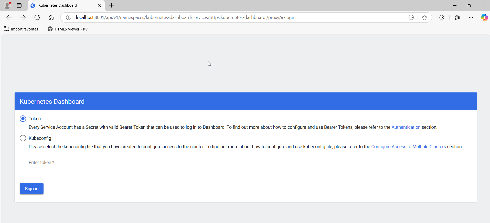


1. Login with the previously generated `<token>`

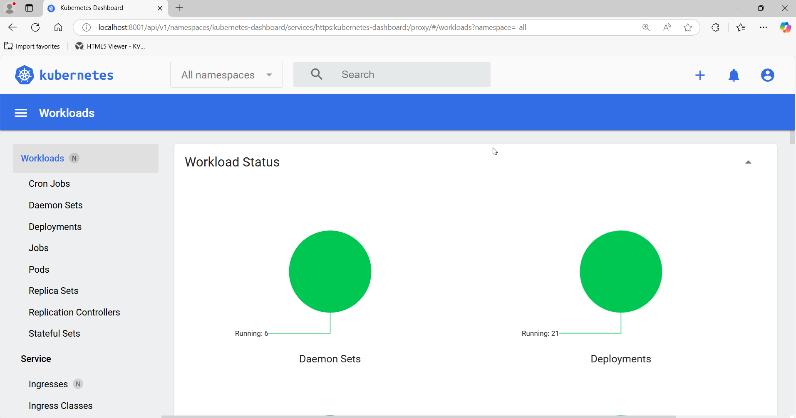

## Installing WordPress Application

WordPress application can be used as a test application.

1. Add `bitnami` repo to helm

```shell
PS C:\Users\user> helm repo add bitnami https://charts.bitnami.com/bitnami
```

2. Create a value override file `values-wp.yaml`

```yaml
mariadb:
  primary:
    persistence:
      enabled: false
  auth:
    password: password
    rootPassword: secretpassword
wordpressUsername: admin
wordpressPassword: password
persistence:
  enabled: false
resources:
  requests:
    cpu: 0m
    memory: 0Mi
service:
  type: ClusterIP
  annotations:
    service-proxy.app.orchestrator.io/ports: "80"
    external-dns.alpha.kubernetes.io/hostname: "wordpress.example.org"
```

3. Install WordPress via helm

```shell
PS C:\Users\user> helm install my-wordpress bitnami/wordpress --namespace wordpress --create-namespace -f .\values-wp.yaml --version 19.4.3
```

4. Apply network policy for `wordpress` namespace create a file `wp-net-policy.yaml` and apply.

```yaml
apiVersion: networking.k8s.io/v1
kind: NetworkPolicy
metadata:
  name: wordpress-egress
  namespace: wordpress
spec:
  egress:
  - {}
  policyTypes:
  - Egress
---
apiVersion: networking.k8s.io/v1
kind: NetworkPolicy
metadata:
  name: wordpress-ingress
  namespace: wordpress
spec:
  ingress:
  - {}
  podSelector: {}
  policyTypes:
  - Ingress
```

```shell
PS C:\Users\user> kubectl apply -f wp-net-policy.yaml
```

5. View the pods running

```shell
PS C:\Users\user> kubectl get pods -n wordpress
NAME                           READY   STATUS    RESTARTS       AGE
my-wordpress-d57b44f9c-lw69m   1/1     Running   3 (3m4s ago)   10m
my-wordpress-mariadb-0         1/1     Running   0              10m
```

6. Forward port to be able to access WP 

```shell
PS C:\Users\user> kubectl port-forward --namespace wordpress svc/my-wordpress 80:80
```

7. Access the WP blog from browser using `http://127.0.0.1//admin` URL.

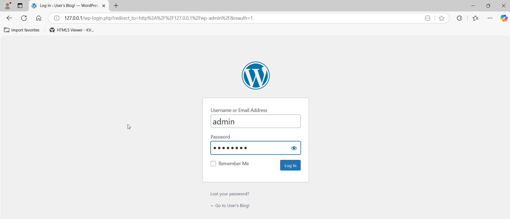

8. Login using the `admin` (login) and `password` (password) credentials

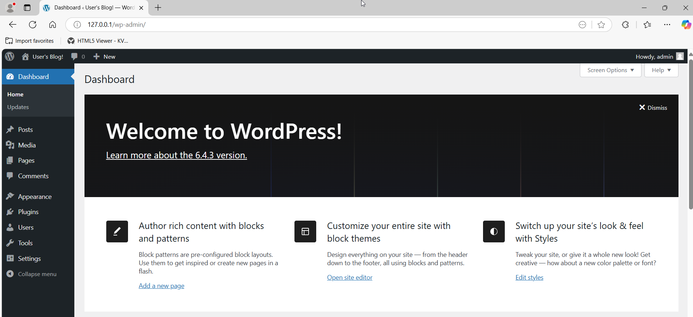

## Installing PDD application

[The Get Started guide for PDD provides additional context for the PDD application](https://literate-adventure-7vjeyem.pages.github.io/edge_orchestrator/content/user_guide/ai_solutions/get_started_pdd.html)

1. Login to registry

```shell
PS C:\Users\user> helm registry login <RELEASE_SERVICE_URL>
Username: user
Password: <JWT Token>
```

2. Create an override values file `pdd-values.yaml`

```yaml
namespace: pdd
DOCKER_REGISTRY: rs-proxy.rs-proxy.svc.cluster.local:8443/pallet-defect-detection/
env:
  VISUALIZER_GRAFANA_USER: root
  VISUALIZER_GRAFANA_PASSWORD: evam123
```

3. Install PDD helmchart

```shell
PS C:\Users\user> helm install pdd oci://<RELEASE_SERVICE_URL>/pallet-defect-detection/pallet-defect-detection-reference-implementation --version 1.1.0 --insecure-skip-tls-verify -f ./pdd-values.yaml -n pdd --create-namespace
```

4. List pods

```shell
PS C:\Users\user> kubectl get pods -n pdd
NAME                                                              READY   STATUS    RESTARTS   AGE
deployment-edge-video-analytics-microservice-5dd9b86b4c-lttvw     1/1     Running   0          15h
deployment-multimodal-data-visualization-7985846c7-fszll          1/1     Running   0          15h
deployment-multimodal-data-visualization-streaming-5c6fbb8rz25k   1/1     Running   0          15h
```

5. Apply network policy for `pdd` namespace create a file `pdd-net-policy.yaml` and apply.

```yaml
apiVersion: networking.k8s.io/v1
kind: NetworkPolicy
metadata:
  name: pdd-egress
  namespace: pdd
spec:
  egress:
  - {}
  policyTypes:
  - Egress
---
apiVersion: networking.k8s.io/v1
kind: NetworkPolicy
metadata:
  name: pdd-ingress
  namespace: pdd
spec:
  ingress:
  - {}
  podSelector: {}
  policyTypes:
  - Ingress
```

```shell
PS C:\Users\user> kubectl apply -f pdd-net-policy.yaml
```

6. Get the node IP address

```shell
PS C:\Users\user> kubectl get nodes -o jsonpath="{range .items[*]}{.status.addresses[?(@.type=='InternalIP')].address}{'\n'}{end}"
<IP>
```

7. Get the PDD application service port

```shell
PS C:\Users\user> kubectl -n pdd get svc multimodal-data-visualization -o jsonpath="{.spec.ports[0].nodePort}`n"
<port>
```
If your edge node isn't externally accessible you can also port forward the service like so
```shell
PS C:\Users\user> kubectl port-forward -n pdd svc/multimodal-data-visualization 30101:3000 --address 0.0.0.0
```
Using this method you can access grafana on ``localhost:30101``.

8. Access the PDD application `grafana` dashboard from browser using the `<IP>` and `<port>` to form the URL `http://<IP>:<port>`

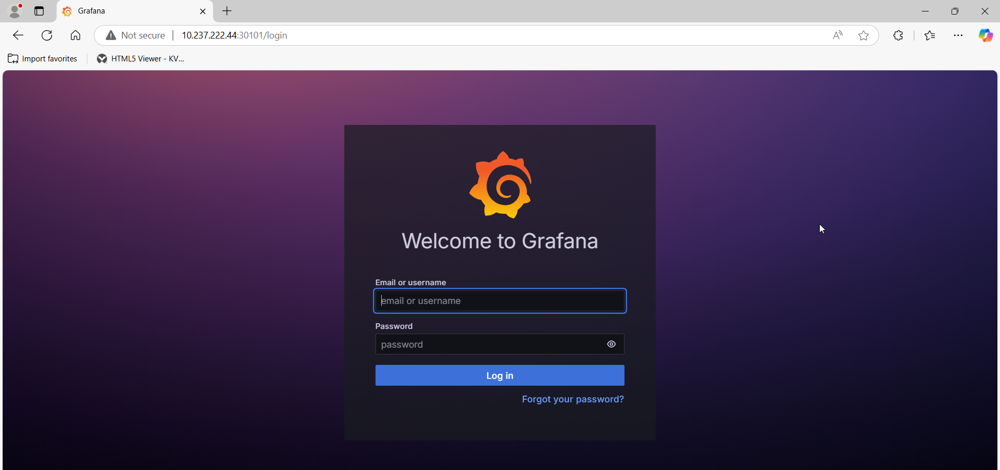

9. Login using the `root` (login) and `evam123` (password) credentials.

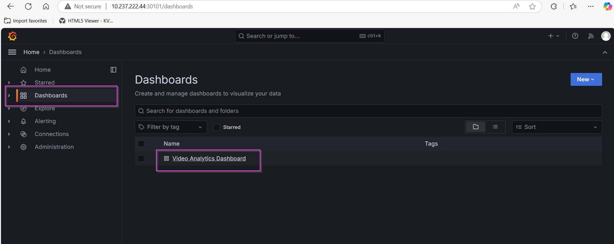

10. Navigate to `Dashboards` -> `Video Analytics Dashboard` and edit each dashboard to point to IP of the Standalone Edge Node by pressing on `...` menu button for each dashboard.

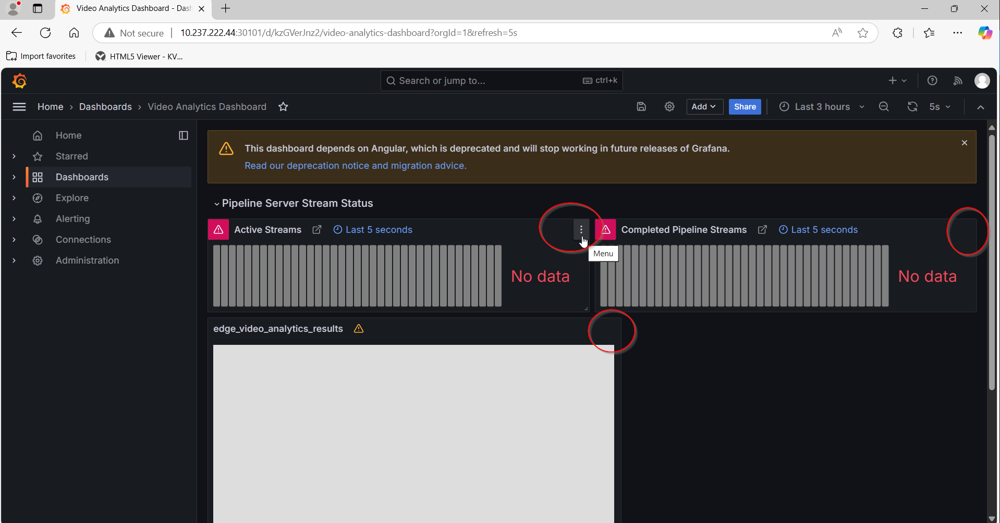

11.  In the `Active Streams` and `Complete Pipeline Streams` dashboards find the `Query` tab and change the default `localhost` address in the `URL` field to an `IP address` of the Standalone Edge Node and click `apply` button. 

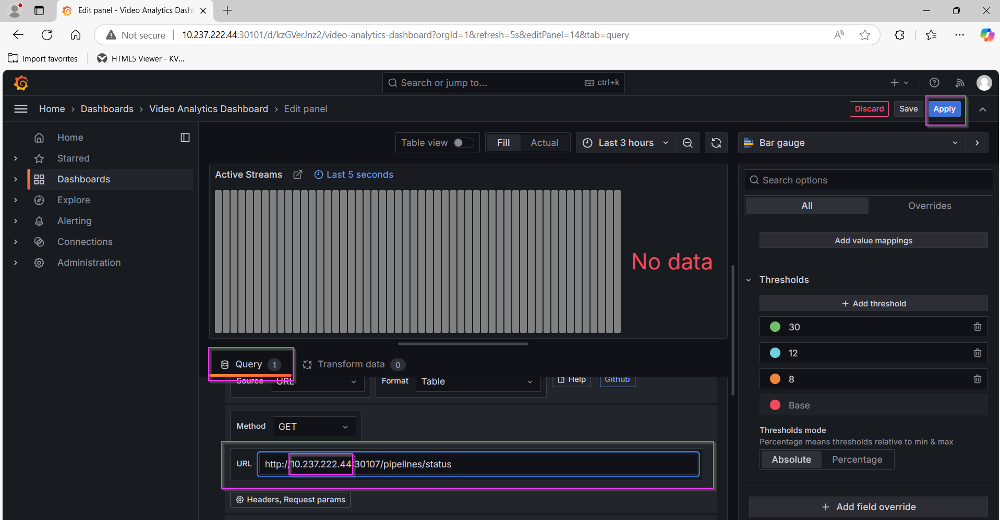

12. In the `edge_video_analytics_results` dashboard find the `Panel Options` tab and change the default `localhost` address in the `URL` field to an `IP address` of the Standalone Edge Node and click `apply` button.

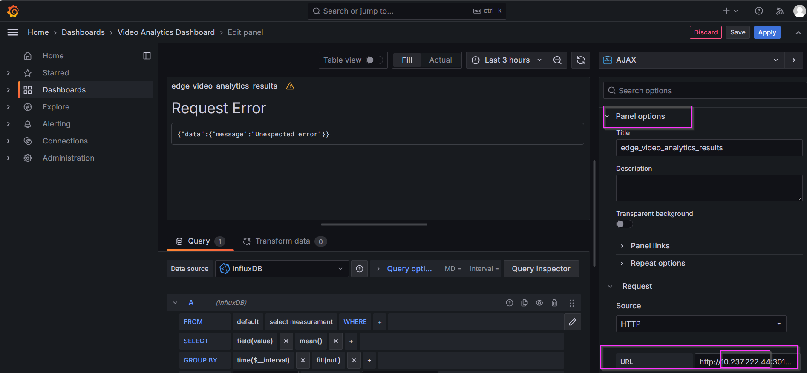

13. Run the pipeline - change the `<EN_IP>` in the URI.

```shell
PS C:\Users\user> $json = @"
{
  "source": {
    "uri": "file:///home/pipeline-server/resources/videos/warehouse.avi",
    "type": "uri"
  },
  "parameters": {
    "udfloader": {
      "udfs": [
        {
          "name": "python.geti_udf.geti_udf",
          "type": "python",
          "device": "CPU",
          "visualize": "true",
          "deployment": "./resources/models/geti/pallet_defect_detection/deployment",
          "metadata_converter": "null"
        }
      ]
    }
  }
}
"@
# Replace the <EN_IP>
PS C:\Users\user> $uri = "http://<EN_IP>:30107/pipelines/user_defined_pipelines/pallet_defect_detection"
PS C:\Users\user> $headers = @{
    "Content-Type" = "application/json"
}

PS C:\Users\user>  Invoke-RestMethod -Uri $uri -Method Post -Headers $headers -Body $json
```

14. View the stream and the analytic data from the dashboard

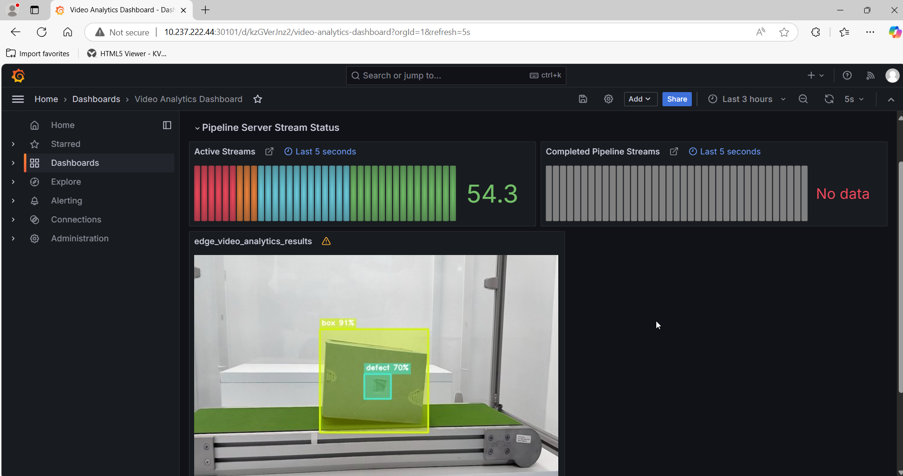

## Accessing metrics from Standalone Edge Node

### Accessing Grafana

Grafana is installed and used to access metrics form the Edge Node to access Grafana

1. Get the username and password

```shell
PS C:\Users\dkopyto\.kube> kubectl get secret grafana -n observability -o jsonpath="{.data.admin-user}" | % { [System.Text.Encoding]::UTF8.GetString([Convert]::FromBase64String($_)) }
```

```shell
PS C:\Users\dkopyto\.kube> kubectl get secret grafana -n observability -o jsonpath="{.data.admin-password}" | % { [System.Text.Encoding]::UTF8.GetString([Convert]::FromBase64String($_)) }
```

2. Access Grafana from browser at Edge Node IP and port `32000` and login using credentials

```shell
http://<EN IP>:32000
```

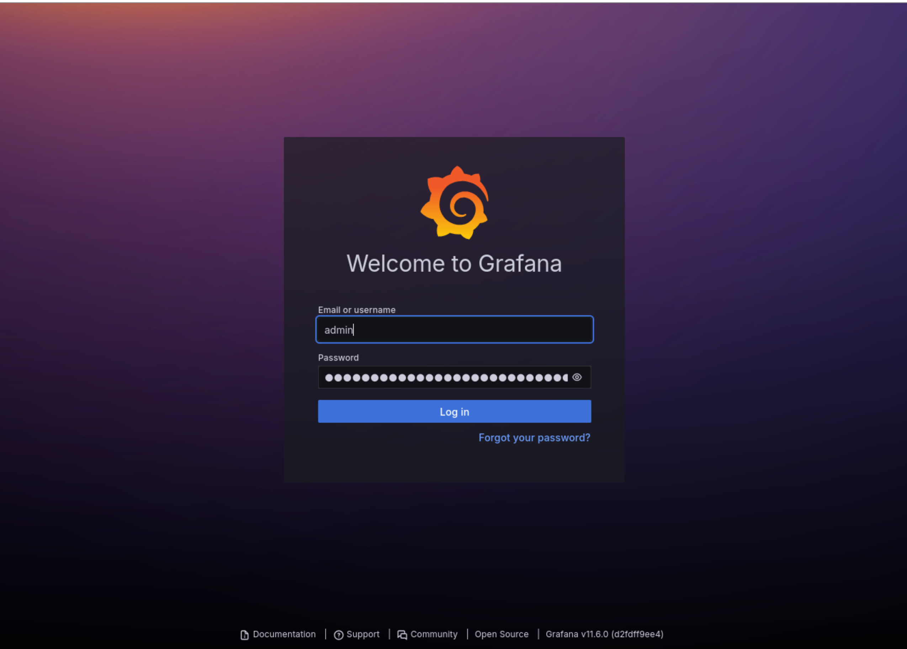

### Adding prometheus metrics to Grafana 

Next you'll need the prometheus TLS credentials.
**Note**: The following commands are in powershell but using ``base64 --decode`` on a linux setup works just as well.

1. Get Prometheus credentials
```shell
PS C:\Users\user> $key=kubectl get secret -n observability prometheus-tls -o jsonpath="{['data']['tls\.key']}"
PS C:\Users\user> $cert=kubectl get secret -n observability prometheus-tls -o jsonpath="{['data']['tls\.crt']}"
PS C:\Users\user> $ca=kubectl get secret -n observability prometheus-tls -o jsonpath="{['data']['ca\.crt']}"
PS C:\Users\user> [Text.Encoding]::Utf8.GetString([Convert]::FromBase64String($key)) 
<key>
PS C:\Users\user> [Text.Encoding]::Utf8.GetString([Convert]::FromBase64String($cert)) 
<cert>
PS C:\Users\user> [Text.Encoding]::Utf8.GetString([Convert]::FromBase64String($ca)) 
<ca>
```

2. In grafana navigate to ``connections/Data sources`` 

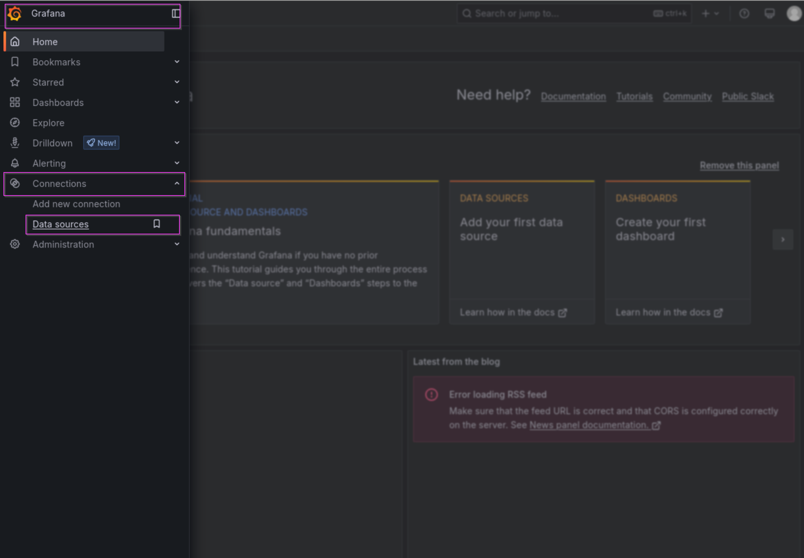

3. Add a new prometheus data source.

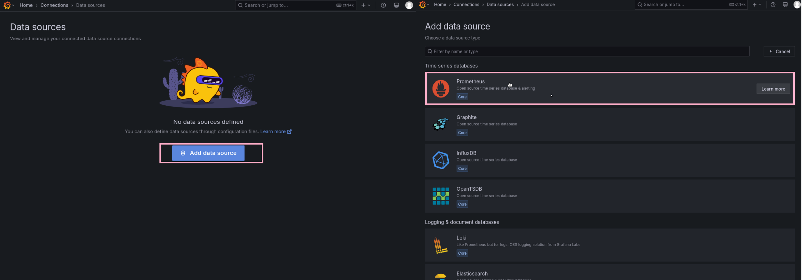

4. Configure the data source, filling in the ca, cert and key gathered earlier. Set the url and server name as ``https://prometheus-prometheus.observability.svc.cluster.local:9090`` and save.

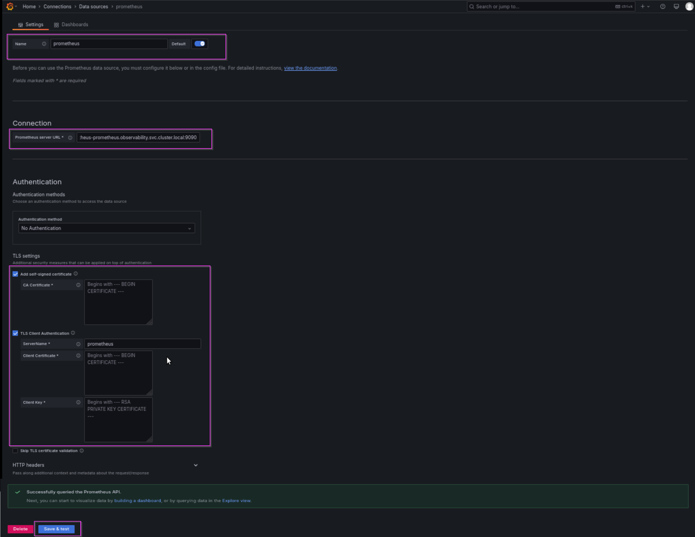
   
### Querying metrics

1. Create a dashboard using prometheus data source
   
   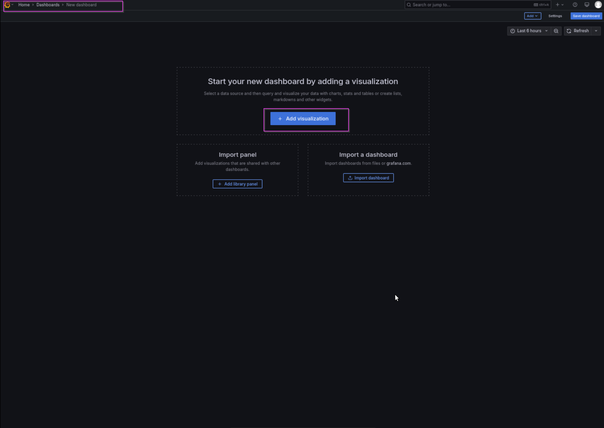

2. Select the data source

  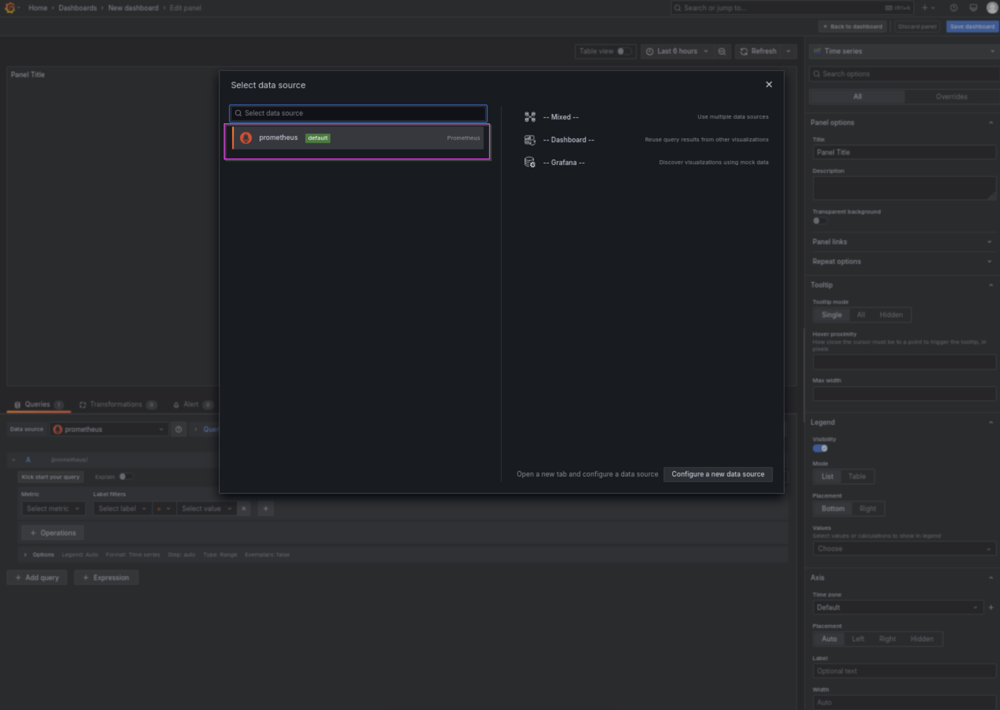

3. Select metrics to query, use metric explorer to view available metrics. User `Run query` button to run queries. Build the required dashboard and save using the `Save dashboard` button.

  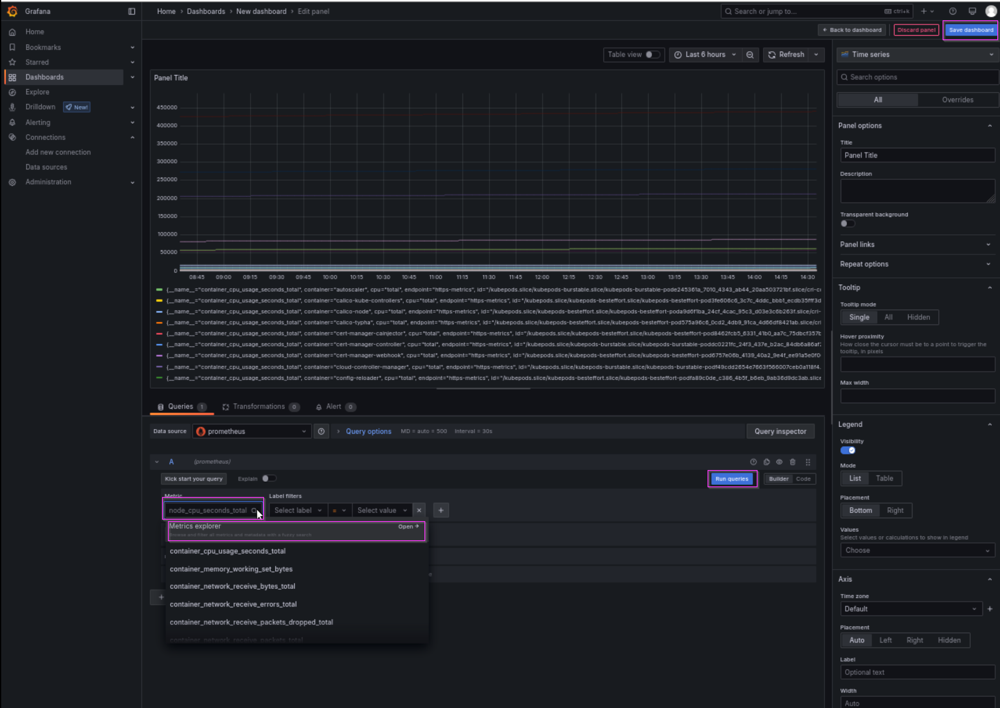
