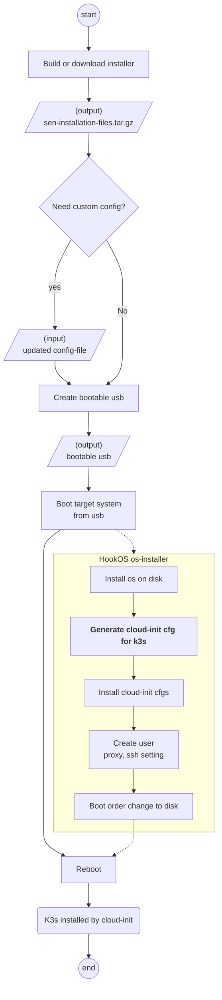

# Design Proposal: Edge Microvisor Toolkit Standalone Installer and Importer

Author(s): Hyunsun Moon

Last updated: 5/12/25

## Abstract

The Edge Microvisor Toolkit Standalone (EMT-S) provides a simplified approach to deploying an EMT edge without relying on the Edge Manageability Framework (EMF). This solution is particularly suited for quick EMT trials or use cases where connecting to a centralized EMF is either impractical or unnecessary.

This proposal focuses on enhancing the Kubernetes installer for EMT-S to support the same level of Kubernetes configurability as EMF-managed edges, including critical environment-specific configurations to ensure successful cluster creation such as Pod and Service subnet ranges and private registry mirrors. To achieve this, it introduces the ability to use a cluster template as input for building EMT-S bootable images. The installer updates also incorporate recent design decisions, such as the transition from RKE2 to K3s as the default Kubernetes distribution [todo: add link] and the integration of K3s into the EMT image [todo: add link].

## Proposal

The proposed EMT-S installation process is outlined in the following flowchart:



#### Kubernetes Configuration in `config-file`

A new Kubernetes Configuration section will be added to the [`config-file`](https://github.com/open-edge-platform/edge-microvisor-toolkit-standalone-node/blob/main/standalone-node/installation_scripts/config-file). This section will align with the EMF default cluster template, which is based on the `spec` part of the [CAPI K3s ConfigSpec Custom Resource Definition](https://github.com/k3s-io/cluster-api-k3s/blob/main/bootstrap/api/v1beta2/kthreesconfig_types.go#L27). Below is an example:

```yaml
---
kubernetes: 
  kind: "KThreesControlPlaneTemplate"
  apiVersion: "controlplane.cluster.x-k8s.io/v1beta2"
  spec: 
    template: 
      spec: 
        # version is not updatable
        version: "v1.33.0+k3s1"
        files:
          path: "/var/lib/rancher/k3s/agent/etc/containerd/config.toml.tmpl"
          content: |
            {{ template \"base\" . }}

            [plugins.'io.containerd.cri.v1.runtime'.containerd.runtimes.'custom']
              runtime_type = "io.containerd.runc.v2"

            [plugins.'io.containerd.cri.v1.runtime'.containerd.runtimes.'custom'.options]
              BinaryName = "/usr/bin/custom-container-runtime"
              SystemdCgroup = true
        preK3sCommands: 
            - "mkdir -p /etc/systemd/system/k3s.service.d"
            - "echo '[Service]
EnvironmentFile=/etc/environment' > /etc/systemd/system/k3s.service.d/override.conf"
        agentConfig: 
          kubeletArgs: 
            - "--tls-cipher-suites=TLS_ECDHE_RSA_WITH_AES_128_GCM_SHA256,TLS_AES_256_GCM_SHA384,TLS_ECDHE_RSA_WITH_AES_256_GCM_SHA384,TLS_ECDHE_ECDSA_WITH_AES_256_GCM_SHA384"
          # airGapped configurations are not updatable
          airGapped: true
          airGappedInstallScriptPath: "/opt/install.sh"
        serverConfig: 
          disableComponents: 
            - "cloudController"
          kubeAPIServerArg: 
            - "--tls-cipher-suites=TLS_ECDHE_RSA_WITH_AES_128_GCM_SHA256,TLS_AES_256_GCM_SHA384,TLS_ECDHE_RSA_WITH_AES_256_GCM_SHA384,TLS_ECDHE_ECDSA_WITH_AES_256_GCM_SHA384"
          kubeControllerManagerArgs: 
          kubeSchedulerArgs: 
          clusterCidr: "10.42.0.0/16"
          serviceCidr: "10.43.0.0/16"
```

Users can modify these values when passing the `config-file` as a parameter for `bootable-usb-prepare.sh`. Most fields from the CAPI K3s Control Plane CRD spec can be configured through the `config-file`, except for the following:

- **Version**: The Kubernetes version is fixed to the K3s version embedded in EMT.
- **Files**: Configuration is limited to `/etc` and `/var` directories.
- **AgentConfig.AirGapped and AgentConfig.SirGappedInstallScriptPath**: These are always set to `true` and pre-defined path to ensure compatibility with K3s assets embedded in EMT image.

#### `config-file` format transition to YAML

The current `config-file` format is raw text. To improve readability and validation, we propose switching to a YAML format, as shown below:

```yaml
version: 1.0
operatingSystem:
  users:
    - username: root
      password: cGFzc3dvcmQK
  proxy:
    httpProxy: http://proxy.example.com
    httpsProxy: http://proxy.example.com
    noProxy: localhost,127.0.0.1,10.0.0.0/8,192.168.0.0/16,.example.com
  sshKey:
kubernetes:
  kind: "KThreesControlPlaneTemplate"
  apiVersion: "controlplane.cluster.x-k8s.io/v1beta2"
  spec: 
    ...
```

Additionally, as the `config-file` content expands, the validation logic in `bootable-usb-prepare.sh` will be enhanced to ensure correctness before the file is used. YAML is better suited for this purpose.

#### Processing Kubernetes Configuration

The `config-file` will be processed by Hook OS during the OS installation via the [`os-installer` service](https://github.com/open-edge-platform/edge-microvisor-toolkit-standalone-node/blob/main/standalone-node/hook_os/hook-os.yaml#L159), which runs the [`install-os.sh`](https://github.com/open-edge-platform/edge-microvisor-toolkit-standalone-node/blob/main/standalone-node/hook_os/files/install-os.sh) script. A new step will be added to `install-os.sh` to process the Kubernetes Configuration section and generate a cloud-init configuration (`/mnt/etc/cloud/cloud.cfg.d/kubernetes-installer.cfg`) for the target OS. The static Kubernetes bootstrap command in the default [`cloud-init.yaml`](https://github.com/open-edge-platform/edge-microvisor-toolkit-standalone-node/blob/main/standalone-node/hook_os/files/cloud-init.yaml) will be removed.

#### Cluster Bootstrapper

A new Go-based tool, `cluster-bootstrapper`, will be introduced to generate the cloud-init configuration from the Kubernetes Configuration section of the `config-file`. This tool will leverage the [CAPI K3s bootstrap provider codebase](https://github.com/k3s-io/cluster-api-k3s/tree/main/pkg/cloudinit). The `cluster-bootstrapper` binary will be released as a Docker image and included in the `volume` section of `hook-os.yaml` for use by the `install-os.sh` script. 

```yaml
# hook-os.yaml
...
services:
  - name: os-installer
    image: debian:12.10
    command: ["/bin/bash", "-c", "/etc/scripts/install-os.sh"]
    capabilities:
      - all
    net: host
    binds.add:
      - /dev:/dev
      - /run:/run
      - /etc/scripts:/etc/scripts/
      - /:/host
      - /var/log/os-installer.log:/var/log/os-installer.log
      - /etc/scripts/install-os.sh:/etc/scripts/install-os.sh
      - bootstrapper:/mnt/bootstrapper
    runtime:
      mkdir:
        - /var/lib/os-installd
    devices:
      - path: all
        type: b
      - path: all
        type: c
volumes:
- name: bootstrapper
  image: registry-rs.edgeorchestration.intel.com/edge-node/cluster-bootstrapper:1.0.0
  readonly: true
```

Example of `cluster-bootstrapper` usage in `install-os.sh`.

```bash
create_cloud_init_for_k8s() {
    /mnt/bootstrapper/cluster-bootstrapper -config-file "$CONFIG_FILE" -out /mnt/etc/cloud/cloud.cfg.d/k8s.cfg
    chmod +x /mnt/etc/cloud/cloud.cfg.d/k8s.cfg
}
```

#### First Boot Behavior

With these changes, upon the first boot, the cloud-init configuration generated by the `cluster-installer` tool will bootstrap K3s on the target system.

### Addon installation

## Rationale

Alternatively, the [K3s config file](https://docs.k3s.io/installation/configuration#configuration-file) can be used to pass custom K3s configurations to a target system. This approach simplifies the process, as additional configurations can be directly copied to a file under `/etc/rancher/k3s/config.yaml.d/`, eliminating the need for cloud-init conversion. However, using a cluster template instead of a raw K3s configuration file offers several advantages:

- **Enhanced Flexibility**: The cluster template supports advanced configurations that go beyond native K3s configuration capabilities. These include pre- and post-installation commands and the ability to create supplementary files. Such features are particularly useful for tasks like configuring proxies or customizing containerd settings, as demonstrated in EMF-managed edges.
- **Consistency**: It ensures a uniform configuration approach, providing consistent user experience when transitioning EMT-S edge to an EMF-managed edge in the future.
- **Extensibility**: The cluster template design is more scalable, enabling support for other Kubernetes distributions compatible with the Cluster API (CAPI).

## Affected components and Teams

Cluster Orchestration
Edge Microvisor Toolkit Standalone

## Implementation plan

[A description of the implementation plan, who will do them, and when.
This should include a discussion of how the work fits into the product's
quarterly release cycle.]

## Open issues (if applicable)

[A discussion of issues relating to this proposal for which the author does not
know the solution. This section may be omitted if there are none.]
