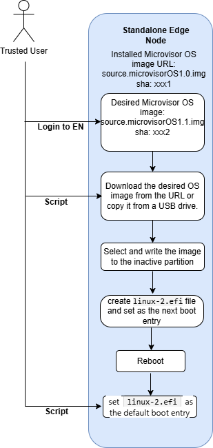

# Design Proposal: A/B Update of Edge Microvisor Toolkit - Standalone (EMT-S)

Author(s): Edge Infrastructure Manager Team

Last updated: 06/20/2025

## Abstract

This document is a design proposal for the A/B Partition Day 2 update of an edge node (EN)
with an immutable EMT image.
This design proposal aims to enhance the EMT image update process for edge nodes, ensuring
that new features can be
delivered without requiring end users to reinstall their software.

## Proposal

The immutable EMT image is updated with a new image version at the image level.
It will require creation of two read-only partitions: the A and B partitions. The A partition will be persistent
and keep the original EMT image installation. The B partition will be used to install a new EMT image.
Depending on the status of the update, the EMT will boot from the new partition (B) or
roll back to the original partition (A) in case of a failure.

## Rationale

A new script is in development. It will invoke the os-update-tool, rather than modifying and expanding the
os-update-tool itself to include the functionality needed for pulling an image and executing the update.
This change will be applicable only to EMT immutable images. Both process and tool do not support EMT mutable images.

## Implementation Plan

- First, create a unique directory, using the `mktemp` command
  `TEMP_DIR=$(mktemp -d)`
- Use the `mount` command to mount the USB drive to the temporary directory
  Example:
  `sudo mount /dev/sdb1 "$TEMP_DIR"`

To perform the A/B upgrade procedure for an immutable EMT image, follow the steps below:

1. Log in as admin to the EMT-S edge node and execute the script located at `/etc/cloud/emt-img-update.sh`.

   This script is responsible for initiating the EMT image update process.

2. Specify two required arguments in `/etc/cloud/emt-img-update.sh`:

   - The URL or USB mount path where the desired EMT image is located.
   - The URL or USB mount path for the SHA file corresponding to the EMT image, which is used
     for integrity verification.

   **Sample commands:**

   - Using a direct path:

     ```bash
     emt-img-update.sh -i /$TEMP_DIR/edge-readonly-3.0.20250518.2200-signed.raw.gz -c /$TEMP_DIR/edge-readonly-3.0.20250518.2200-signed.raw.gz.sha256sum
     ```

     ```bash
     emt-img-update.sh /home/user/edge-readonly-3.0.20250518.2200-signed.raw.gz /home/user/edge-readonly-3.0.20250518.2200-signed.raw.gz.sha256sum
     ```

   - Using a URL:

     ```bash
     emt-img-update.sh -u <url_to_emt_image> <url_to_sha_file>
     ```

3. Execute the `/etc/cloud/emt-image-update.sh` script to invoke `/usr/bin/os-update-tool.sh`
   for the update procedure.

   - Execute the update tool script with the `-w` parameter to write into the inactive partition:

     ```bash
     os-update-tool.sh -w -u <file_path_to_EMT_image> -s <check_sum_value>
     ```

   - Execute the update tool with the `-a` parameter to use the newly written image for the next boot:

     ```bash
     os-update-tool.sh -a
     ```

4. Create the default user.

   After the EMT image update, use the `os-update.sh` script to modify the `/etc/cloud/config-file`
   file to create the default user.

   > **Note:** In this release, you can configure `cloud-init` to create **only** the default user.

5. Restart the system to boot from the newly applied EMT image.

6. Upon successful boot, verify that the system is running correctly with the new image:

   ```bash
   sudo bootctl list
   ```

   ```bash
   sudo cat /etc/lsb-release
   ```

7. Make the new image persistent for future boots, using the following command:

   ```bash
   os-update-tool.sh -c
   ```

> **Note:** **Step 6 is the only step** that can be integrated into the `cloud-init` script.

The diagram below presents the entire process of A/B Update for EMT-S.



## Test Plan

Following tests have been planned to verify this feature:

1. Update the edge node with the latest version of the EMT image.
2. Update the edge node with the older version of the EMT image.
3. Provision the EN with a specific profile (EMT Non-RT) that includes K3s and Docker,
   and then update the EMT image.
4. Test the system's ability to handle unexpected or incorrect EMT image versions and its
   fallback mechanism
