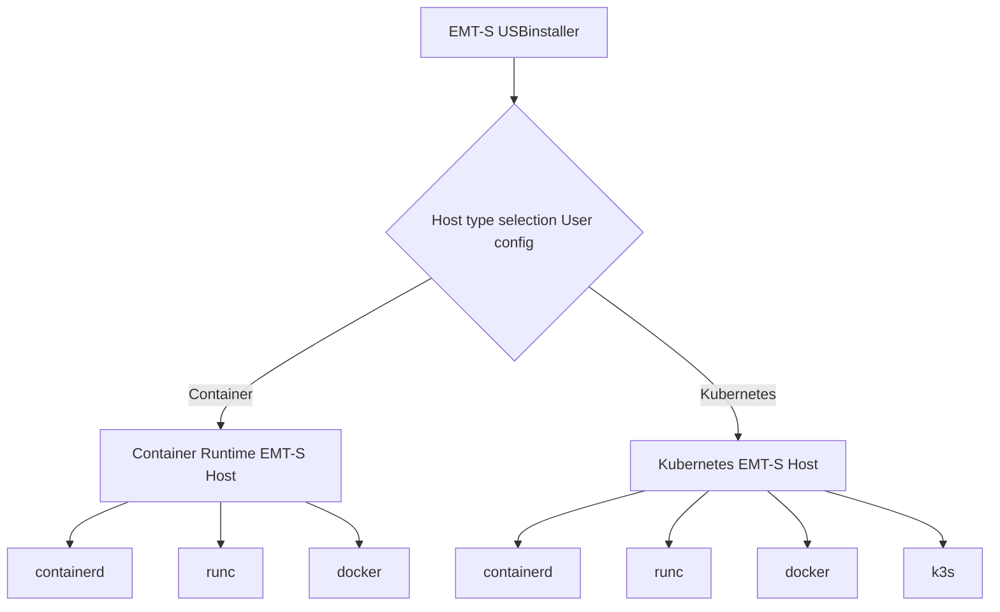

# Design Proposal: Kubernetes Installer Enhancement

Author(s): Krishna, Mats, Shankar, Anand.

Last updated: 03/06/2025

## Abstract

The Edge Microvisor Toolkit Standalone (EMT-S) provides a simplified approach to deploying an Edge Microvisor Toolkit
(EMT) edge. There are usecases where customer would like to deploy native container apps without using Kubernetes for
container orchestration.

To enable this use case, going forward EMT will support container runtime and kubernetes installer as part of the same
immutable image.

This proposal focuses on enabling the installation of container only host and kubernetes host using the same image.
The proposal is to leverage the current user input configuration mechanism to allow users to select the type of host
they want to deploy.

## Proposal

Edge Microvisor Toolkit Standalone uses the [config](https://github.com/open-edge-platform/edge-microvisor-toolkit-standalone-node/blob/main/standalone-node/installation_scripts/config-file)
file to take user inputs during bootable USB creation. This user input will be used to configure setting during the EMT
provisioning process.

The proposal is to extend the current user input configuration mechanism to allow users to select the type of host they
want to deploy. The user will be able to choose between a container only host or a kubernetes host. This can be a new
section like below:

```bash
# ------------------ Host type ------------------------
# Choose the type of host to deploy: container or kubernetes.
# Example: host_type="container" or host_type="kubernetes"
host_type=""
```

By default `host_type=kubernetes` will be set. Any error input should stop the provisioning process.



### User Experience

- User creates a bootable USB using the EMT-S USB Installer.
- During creation, the user edits the config-file to set `host_type`.
- On boot, the installer reads `host_type` and provisions the appropriate host.
- If an invalid value is provided, the installer halts and displays an error.

### Default Behavior

When user has not set the `host_type`, `kubernetes` will be the default host type.
