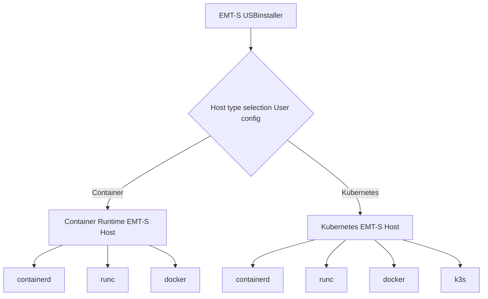

<!--
SPDX-FileCopyrightText: (C) 2025 Intel Corporation
SPDX-License-Identifier: Apache-2.0
 -->

# Design Proposal: Kubernetes Installer Enhancement

Author(s): Krishna, Mats, Shankar, Anand.

Last updated: 03/06/2025

## Abstract

The Edge Microvisor Toolkit Standalone (EMT-S) provides simplified edge node deployment.
There are use cases where customers would like to manage container orchestration without
Kubernetes and deploy native container apps.

To accommodate this use case, the toolkit will support container runtime and kubernetes installer as part of the same
immutable image.

## Proposal

To deploy the standalone node, user needs to configure settings in the
[config-file](https://github.com/open-edge-platform/edge-microvisor-toolkit-standalone-node/blob/main/standalone-node/installation_scripts/config-file),
required for creation of a bootable USB drive.

This proposal focuses on enabling the installation of a container only host and a kubernetes host using the same image.
It will improve the current configuration by allowing users to select the type of host they
want to deploy. For that, a new section in config-file will be added:

```bash
# ------------------ Host type ------------------------
# Choose the type of host to deploy: container or kubernetes.
# Example: host_type="container" or host_type="kubernetes"
host_type=""
```

By default, `host_type=kubernetes` will be set. Any input error will stop the provisioning process.



### User Experience

- User creates a bootable USB drive.
- During creation, the user edits config-file to set `host_type`.
- On boot, the installer reads `host_type` and provisions the appropriate host.
- If an invalid value is provided, the installer halts and displays an error.

### Default Behavior

If the `host_type` is not set, the default `kubernetes` host type will be used.
