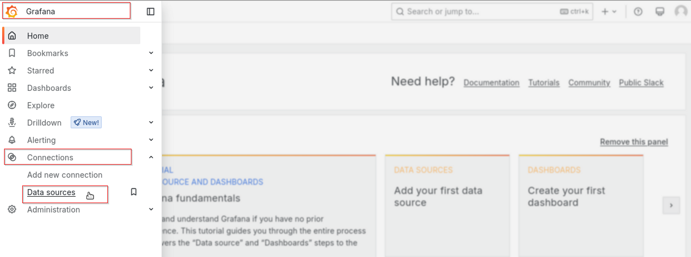
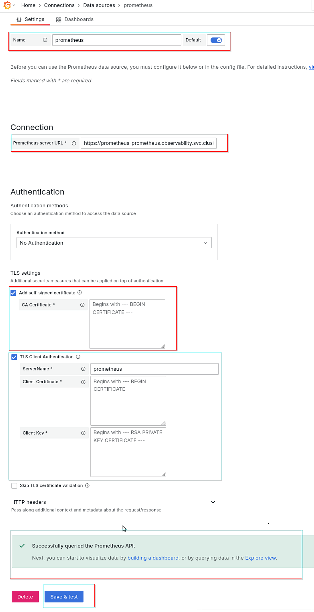
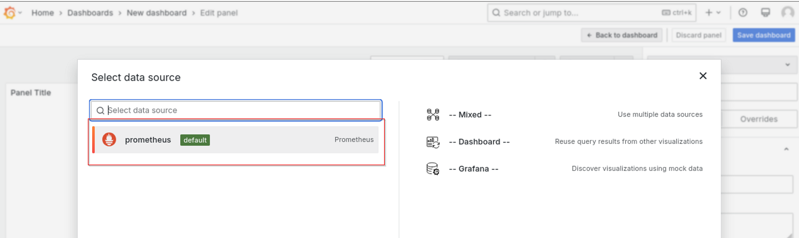

# Standalone Node USB based provisioning

## Get Started

The current release of the Intel® Edge Microvisor Toolkit Standalone Node supports the creation of a bootable USB drive
on Linux based operating systems. This section provides step-by-step instructions to set up the environment required
for USB-based provisioning for the standalone node.

Source code for the Intel® Edge Microvisor Toolkit Standalone Node is available at [Open Edge Platform GitHub](https://github.com/open-edge-platform/edge-microvisor-toolkit-standalone-node).

### Step 1: Prerequisites

#### 1.1: Docker and docker proxy Setup

Ensure that Docker is installed and all necessary settings (such as proxy configurations) are properly configured.  
Refer to the links below for Docker installation and proxy setup:

- [Docker Installation Docs](https://docs.docker.com/engine/install/ubuntu/)
- [Docker Proxy Setup](https://docs.docker.com/engine/daemon/proxy/)

> **Note:** Ubuntu 22.04 is the preferred OS for the build setup.

#### 1.2: Repository Setup

Begin by cloning the repository that contains all necessary scripts and configurations for deployment. This step
is crucial for accessing the tools required for standalone node

```bash
git clone https://github.com/open-edge-platform/edge-microvisor-toolkit-standalone-node
cd edge-microvisor-toolkit-standalone-node
```

#### 1.3: Proxy settings

> **Note:** If the development system is behind a firewall, ensure to add the proxy configuration in the standalone-node/hook_os/config file

- Update the config file
  
   ```bash
   vi config

   # Proxy configuration
   # Uncomment and set the following variables if you need to use a proxy
   # Replace <proxy_url> with your actual proxy URL and port
   # http_proxy="<proxy_url>"
   # https_proxy="<proxy_url>"
   # ftp_proxy="<proxy_url>"
   # no_proxy="127.0.0.1,localhost,10.0.0.0/8"

   ```

#### 1.4: Create the Standalone Installation Tar File

- To create the standalone installation tar file with all required files for preparing a bootable USB device, run the following command

   ```bash
   sudo make build

   ```

> **Note:** This command will build the hook OS and generate the `sen-installation-files.tar.gz` file.  
  The file will be located in the `$(pwd)/installation-scripts/out` directory.

#### 1.5:  Prepare the USB Drive

- Insert the USB drive into the Developer's System and identify the USB disk:

   ```bash
   lsblk -o NAME,MAJ:MIN,RM,SIZE,RO,FSTYPE,MOUNTPOINT,MODEL
   ```

   > **Note:** Ensure the correct USB drive is selected to avoid data loss.

- Use the wipefs command to remove any existing filesystem signatures from the USB drive. This ensures a clean slate for formatting

   ```bash
   sudo wipefs --all --force /dev/sdX
   ```
   > **Note:** Replace /dev/sdX with the actual device name of your USB drive.

- Format the USB drive with a FAT32 filesystem using the mkfs.vfat command.

   ```bash
   sudo mkfs.vfat /dev/sdX
   ```
   > **Note:** Replace /dev/sdX with the actual device name of your USB drive.

- Copy standalone installation tar file to developer system to prepare the Bootable USB

  Extract the contents of sen-installation-files.tar.gz

  ```bash
   tar -xzf sen-installation-files.tar.gz
  ```

- Extracted files will include

  ```
  usb-bootable-files.tar.gz
  config-file
  bootable-usb-prepare.sh
  edgenode-logs-collection.sh

  ```

- Run the preparation script to create the bootable USB

   ```bash
   sudo ./bootable-usb-prepare.sh /dev/sdX usb-bootable-files.tar.gz config-file
   ```

   ```bash
   Example usage:
   ./bootable-usb-prepare.sh /dev/sdc usb-bootable-files.tar.gz config-file
   ```

  - Required Inputs for the Script:

     ```bash
     - usb: A valid USB device name (e.g., /dev/sdc)
     - usb-bootable-files.tar.gz: The tar file containing bootable files
     - config-file: Configuration file for proxy settings (if the edge node is behind a firewall)
     - Includes ssh_key, which is your Linux device's id_rsa.pub key for passwordless SSH access to the edge node
     - User credentials: Set the username and password for the edge node
     ```

     > **Note:**  Providing proxy settings is optional if the edge node does not require them to access internet services.

## Step 2: Deploy on Standalone Node

- Unplug the attached bootable USB from developer system

- Plug the created bootable USB pen drive into the standalone node

- Set the BIOS boot manager to boot from the USB pen drive

- Reboot the Standalone Node
  This will start the HookOS boot followed by Tiber Microvisor installations.

- Automatic Reboot
  The standalone edge node will automatically reboot into Tiber Microvisor.

- First Boot Configuration
  During the first boot, cloud-init will install the RKE2 Kubernetes cluster.

#### 2.1  Login to the Edge Node After Installation complete

Refer to the edge node console output for instructions to verify the kubernetes cluster creation.

Use the Linux login credentials which was provided while preparing the bootable USB drive.

## Step 3: Set up tools on Developer's System

Install and configure [kubectl](https://kubernetes.io/docs/tasks/tools/install-kubectl-linux/) and [helm](https://helm.sh/docs/intro/install/) tools on the Developer's system.

> **Note:** The commands are executed from `Linux` environment, but the same can be achieved from any environment supporting `kubectl` and `helm` by using equivalent commands.

1. Install `kubectl`:

   ```bash
   sudo apt-get update
   sudo apt-get install -y apt-transport-https ca-certificates curl gnupg
   curl -fsSL https://pkgs.k8s.io/core:/stable:/v1.32/deb/Release.key | sudo gpg --dearmor -o /etc/apt/keyrings/kubernetes-apt-keyring.gpg
   sudo chmod 644 /etc/apt/keyrings/kubernetes-apt-keyring.gpg
   echo 'deb [signed-by=/etc/apt/keyrings/kubernetes-apt-keyring.gpg] https://pkgs.k8s.io/core:/stable:/v1.32/deb/ /' | sudo tee /etc/apt/sources.list.d/kubernetes.list
   sudo chmod 644 /etc/apt/sources.list.d/kubernetes.list
   sudo apt-get update
   sudo apt-get install -y kubectl
   ```

2. Copy the kubeconfig file from the Edge Node:

   ```bash
   mkdir ~/.kube
   export EN_IP=<EN_IP>
   scp user@${EN_IP}:/etc/rancher/rke2/rke2.yaml ~/.kube/config
   ```

3. Update the Edge Node IP in the kubeconfig file and export the path as KUBECONFIG:

   ```bash
   sed -i "s/127\.0\.0\.1/${EN_IP}/g" ~/.kube/config
   export KUBECONFIG=~/.kube/config
   ```

4. Test the connection:

   ```bash
   kubectl get pods -A
   ```

5. Install `helm`:

   ```bash
   curl -fsSL -o get_helm.sh https://raw.githubusercontent.com/helm/helm/main/scripts/get-helm-3
   chmod 700 get_helm.sh
   ./get_helm.sh
   ```

## Step 4: Set Up Kubernetes Dashboard Access

1. View the Kubernetes dashboard pods:

   ```bash
   kubectl get pods -n kubernetes-dashboard
   ```

2. Start kube proxy:

   ```bash
   kubectl proxy &
   ```

3. Generate an access token:

   ```bash
   kubectl -n kubernetes-dashboard create token admin-user
   ```

4. Access the dashboard in a browser:
   - Open a web browser on your Ubuntu desktop and navigate to the following URL

     `http://localhost:8001/api/v1/namespaces/kubernetes-dashboard/services/https:kubernetes-dashboard:/proxy/#/login`

     > **Note:**  This URL accesses the Kubernetes Dashboard through the proxy you started earlier.

5. Login using the previously generated access token.

## Step 5: Install Sample Application

Install a WordPress application as a test application using `helm`.

1. Add the `bitnami` repository:

   ```bash
   helm repo add bitnami https://charts.bitnami.com/bitnami
   ```

2. Create a values override file `values-wp.yaml`, replace the `<pass>` with a password and install WordPress:

   ```yaml
   mariadb:
     primary:
       persistence:
         enabled: false
     auth:
       password: <pass>
       rootPassword: <pass>>
   wordpressUsername: admin
   wordpressPassword: <pass>
   persistence:
     enabled: false
   resources:
     requests:
       cpu: 0m
       memory: 0Mi
   service:
     type: ClusterIP
     annotations:
       service-proxy.app.orchestrator.io/ports: "80"
       external-dns.alpha.kubernetes.io/hostname: "wordpress.example.org"
   ```

   ```bash
   helm install my-wordpress bitnami/wordpress --namespace wordpress --create-namespace -f values-wp.yaml --version 19.4.3
   ```

3. Apply network policy for `wordpress` namespace create a file `wp-net-policy.yaml` and apply.

   > **Note:** This policy opens up all ingress and egress traffic in the namespace - tailor down the allowed traffic per needs of an application in non-test app deployments. By default the ingress and egress traffic is set to be denied.

   ```yaml
   apiVersion: networking.k8s.io/v1
   kind: NetworkPolicy
   metadata:
     name: wordpress-egress
     namespace: wordpress
   spec:
     egress:
     - {}
     policyTypes:
     - Egress
   ---
   apiVersion: networking.k8s.io/v1
   kind: NetworkPolicy
   metadata:
     name: wordpress-ingress
     namespace: wordpress
   spec:
     ingress:
     - {}
     podSelector: {}
     policyTypes:
     - Ingress
   ```

   ```bash
   kubectl apply -f wp-net-policy.yaml
   ```

4. View the pods running

   ```bash
   kubectl get pods -n wordpress
   NAME                           READY   STATUS    RESTARTS       AGE
   my-wordpress-d57b44f9c-lw69m   1/1     Running   3 (3m4s ago)   10m
   my-wordpress-mariadb-0         1/1     Running   0              10m
   ```

5. Forward port to be able to access WP

   ```bash
   kubectl port-forward --namespace wordpress svc/my-wordpress 8080:80
   ```

6. Access the WP blog from browser using `http://localhost:8080/admin` URL.

7. Login using the `admin` (login) and `password` (`<pass>`) credentials

> **Note:** Edge AI applications from the Edge software catalog can be installed using `helm` and evaluated using similar steps.

## Step 6: Accessing Grafana

1. Retrieve Grafana credentials:

   ```shell
   echo $(kubectl get secret grafana -n observability -o jsonpath="{.data.admin-user}" | base64 --decode)
   echo $(kubectl get secret grafana -n observability -o jsonpath="{.data.admin-password}" | base64 --decode)
   ```

2. Access Grafana from browser at Edge Node IP and port `32000` and login using credentials

   ```bash
   http://<EN IP>:32000
   ```

## Step 7: Adding Prometheus metrics to Grafana

1. Get Prometheus credentials:

   ```shell
   key=$(kubectl get secret -n observability prometheus-tls -o jsonpath="{['data']['tls\.key']}" | base64 --decode)
   cert=$(kubectl get secret -n observability prometheus-tls -o jsonpath="{['data']['tls\.crt']}" | base64 --decode)
   ca=$(kubectl get secret -n observability prometheus-tls -o jsonpath="{['data']['ca\.crt']}" | base64 --decode)
   printf "%s\n" "$key"
   printf "%s\n" "$cert"
   printf "%s\n" "$ca"
   ```

2. In Grafana navigate to ``connections/Data sources`` :

   

3. Add a new Prometheus data source:

   

4. Configure the data source, filling in the `ca`, `cert` and `key` gathered earlier. Set the `url` as ``https://prometheus-prometheus.observability.svc.cluster.local:9090``, `server name` as `prometheus` and save.

   

## Step 8: Querying Metrics

1. Create a dashboard using prometheus data source:

   

2. Select the data source:

   

3. Select metrics to query, use metric explorer to view available metrics. Use `Run query` button to run queries. Build the required dashboard and save using the `Save dashboard` button:

   

## Troubleshooting

1. Creation of USB pendrive failed
The possible reason could be USB device is mounted. Please unmount the USB drive and retry creating the bootable USB drive.

2. If any issues while provisioning the microvisor from Hook OS, automatically logs will be collected
 from /var/log/os-installer.log file on Hook OS what caused the OS provisioning failed.

3. After sucessful installation A banner is printed at the end, summarizing the installation status and
 providing useful commands/logs path for further management.

### Edge Node Logs from Developer's System

### Edge Node IP address

The edge node operates both the Kubernetes control plane and node services, making it a single-node cluster. It is essential to ensure that the IP address of the edge node remains unchanged after deployment to prevent any indeterminate behavior of the Kubernetes control plane.
