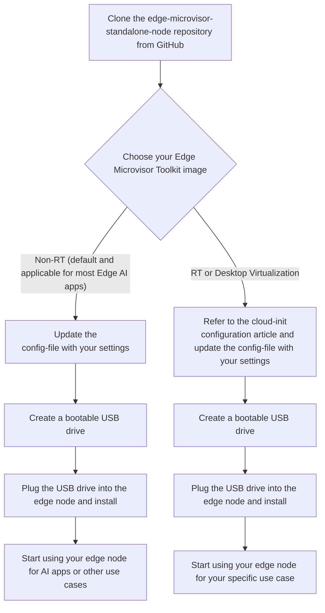

# Get Started

The Edge Microvisor Toolkit Standalone Node uses the standard immutable build. It is published
in two versions: Non-RT and
[RT (with real time extensions)](https://github.com/open-edge-platform/edge-microvisor-toolkit/blob/3.0-dev/docs/developer-guide/emt-architecture-overview.md#edge-microvisor-toolkit-real-time). You can build your own bootable USB from source code,
or use the downloadable ISO image that can be flashed to a USB device and installed on edge
nodes. It installs the microvisor and Kubernetes to the edge node with the essential
functionality to run a single node cluster. The edge node will serve as both the
control and worker node. Additional worker nodes can be added to the cluster
through Kubernetes.

The Standalone Edge Node can be included in
[Edge Manageability Framework](https://github.com/open-edge-platform/edge-manageability-framework),
deployed on-prem or in the cloud to support scale out and management of larger infrastructures.
It enables you to quickly get an edge node up and running without deploying backend
services, ready to deploy Kubernetes applications through `kubectl`, `helm`, or
Kubernetes web dashboard.

## Create Bootable USB from Source Code

On Linux based operating systems, you can also create a bootable USB drive from source code.
This section provides step-by-step instructions to set up the environment required
for USB-based provisioning of the standalone node.

To meet specific needs of edge deployment, Edge Microvisor Toolkit Standalone Node can be
built as one of available OS image versions:

- Edge Microvisor Toolkit Non-RT (default)
- Edge Microvisor Toolkit RT (real-time)
- Edge Microvisor Toolkit Desktop Virtualization

You can create a bootable USB drive with a selected image. For most use cases, the default
non-RT one is recommended.

The diagram below illustrates the steps involved in the USB-based provisioning of the
standalone node.



> **Tip:** For most users, the default Non Realtime image is recommended. Advanced users can swap in other images as needed.

### Step 1: Prerequisites

#### 1.1: Repository Setup

Begin by cloning the repository. It contains all necessary scripts and
configurations for deployment. This step is vital for accessing the tools
required for standalone node.

```bash
git clone https://github.com/open-edge-platform/edge-microvisor-toolkit-standalone-node
cd edge-microvisor-toolkit-standalone-node
```

#### 1.2: Create the Standalone Installation Tar File

- To create the standalone installation tar file with
all required files for preparing a bootable USB device,
run the following command:

   ```bash
   sudo make build
   ```

> **Note:** This command will generate the `standalone-installation-files.tar.gz` file.
  The file will be located in the `$(pwd)/installation-scripts/out` directory.

#### 1.3:  Prepare the USB Drive

> **Note:**
>
> - Ensure **the correct USB drive is selected** to avoid data loss.
> - **Replace /dev/sdX** with the actual device name of your USB drive.

- Insert the USB drive into the Developer's System and identify the USB disk:

   ```bash
   lsblk -o NAME,MAJ:MIN,RM,SIZE,RO,FSTYPE,MOUNTPOINT,MODEL
   ```

   > **Note:** Ensure the correct USB drive is selected
   to avoid data loss.

- Use the `wipefs` command to remove any existing filesystem
  signatures from the USB drive.
  This ensures a clean slate for formatting.

   ```bash
   sudo wipefs --all --force /dev/sdX
   ```

- Format the USB drive with a FAT32 filesystem using the `mkfs.vfat` command:

   ```bash
   sudo mkfs.vfat /dev/sdX
   ```

- Unmount the USB drive to ensure the creation of bootable USB.

  - Check what is currently mounted:

    ```bash
    df -hT
    ```

  - Unmount the drive:

    ```bash
    sudo umount /dev/sdX
    ```

- Copy the standalone installation tar file to developer system to prepare the bootable USB drive.

  Extract the contents of `standalone-installation-files.tar.gz`:

  ```bash
   tar -xzf standalone-installation-files.tar.gz
  ```

- Extracted files will include:

  ```text
  usb-bootable-files.tar.gz
  config-file
  bootable-usb-prepare.sh
  edgenode-logs-collection.sh
  download_images.sh
  ```

- Run the image download script to collect k3s artifacts and any additional images if you're using an IDV image.
  By default the script will only pull k3s artifacts and airgap images (NON-RT).

   ```bash
   sudo ./download_images.sh IDV
   or
   sudo ./download_images.sh NON-RT
   ```

- Run the preparation script to create the bootable USB:

   ```bash
   sudo ./bootable-usb-prepare.sh /dev/sdX usb-bootable-files.tar.gz config-file
   ```

   ```bash
   Example usage:
   ./bootable-usb-prepare.sh /dev/sdc usb-bootable-files.tar.gz config-file
   ```

  - Required Inputs for the Script:

     ```bash
     - usb: A valid USB device name (e.g., /dev/sdc)
     - usb-bootable-files.tar.gz: The tar file containing bootable files
     - config-file: Configuration file for proxy settings (if the edge node is behind a firewall)
     - Includes ssh_key, which is your Linux device's id_rsa.pub key for passwordless SSH access to the edge node
     - User credentials: Set the username and password for the edge node
     ```

     > **Note:**  Providing proxy settings is optional if the edge node does not require them to access internet services.

## Step 2: Deploy on Standalone Node

- Unplug the attached bootable USB from developer system

- Plug the created bootable USB pen drive into the standalone node

- Set the BIOS boot manager to boot from the USB pen drive

- Reboot the Standalone Node
  This will start the Bootkit OS, followed by Microvisor installations.

- Automatic Reboot
  The standalone edge node will automatically reboot into Microvisor.

- First Boot Configuration
  During the first boot, cloud-init will install the K3s Kubernetes cluster.

### 2.1  Login to the Edge Node After Installation complete

Refer to the edge node console output for instructions to verify the kubernetes cluster creation.

Use the Linux login credentials which was provided while preparing the bootable USB drive.
**Note:** If you want to run kubectl commands from the edge
node you can use the provided alias ``k`` which is defined in
the .bashrc of the user defined in your config.

```text
k get pods -A
```

## Step 3: Set up tools on Developer's System

Install and configure
[kubectl](https://kubernetes.io/docs/tasks/tools/install-kubectl-linux/)
and [helm](https://helm.sh/docs/intro/install/) tools on the Developer's system.

> **Note:** The commands are executed from `Linux` environment,
but the same can be achieved from any environment supporting `kubectl` and `helm` by using equivalent commands.

1. Install `kubectl`:

   ```bash
   sudo apt-get update
   sudo apt-get install -y apt-transport-https ca-certificates curl gnupg
   curl -fsSL https://pkgs.k8s.io/core:/stable:/v1.32/deb/Release.key | sudo gpg --dearmor -o /etc/apt/keyrings/kubernetes-apt-keyring.gpg
   sudo chmod 644 /etc/apt/keyrings/kubernetes-apt-keyring.gpg
   echo 'deb [signed-by=/etc/apt/keyrings/kubernetes-apt-keyring.gpg] https://pkgs.k8s.io/core:/stable:/v1.32/deb/ /' | sudo tee /etc/apt/sources.list.d/kubernetes.list
   sudo chmod 644 /etc/apt/sources.list.d/kubernetes.list
   sudo apt-get update
   sudo apt-get install -y kubectl
   ```

2. Copy the kubeconfig file from the Edge Node:

   ```bash
   mkdir ~/.kube
   export EN_IP=<EN_IP>
   scp user@${EN_IP}:/etc/rancher/k3s/k3s.yaml ~/.kube/config
   ```

3. Update the Edge Node IP in the kubeconfig file and export the path as KUBECONFIG:

   ```bash
   sed -i "s/127\.0\.0\.1/${EN_IP}/g" ~/.kube/config
   export KUBECONFIG=~/.kube/config
   ```

4. Test the connection:

   ```bash
   kubectl get pods -A
   ```

5. Install `helm`:

   ```bash
   curl -fsSL -o get_helm.sh https://raw.githubusercontent.com/helm/helm/main/scripts/get-helm-3
   chmod 700 get_helm.sh
   ./get_helm.sh
   ```

## Step 4: Install Sample Application

Install a WordPress application as a test application using `helm`.

1. Add the `bitnami` repository:

   ```bash
   helm repo add bitnami https://charts.bitnami.com/bitnami
   ```

2. Create a values override file `values-wp.yaml`, replace the `<pass>` with a password and install WordPress:

   ```yaml
   mariadb:
     primary:
       persistence:
         enabled: false
     auth:
       password: <pass>
       rootPassword: <pass>>
   wordpressUsername: admin
   wordpressPassword: <pass>
   persistence:
     enabled: false
   resources:
     requests:
       cpu: 0m
       memory: 0Mi
   service:
     type: ClusterIP
     annotations:
       service-proxy.app.orchestrator.io/ports: "80"
       external-dns.alpha.kubernetes.io/hostname: "wordpress.example.org"
   ```

   ```bash
   helm install my-wordpress bitnami/wordpress --namespace wordpress --create-namespace -f values-wp.yaml --version 19.4.3
   ```

3. Apply network policy for `wordpress` namespace create a file `wp-net-policy.yaml` and apply.

   > **Note:** This policy opens up all ingress and egress
   traffic in the namespace - tailor down the allowed traffic
   per needs of an application in non-test app deployments. By
   default the ingress and egress traffic is set to be denied.

   ```yaml
   apiVersion: networking.k8s.io/v1
   kind: NetworkPolicy
   metadata:
     name: wordpress-egress
     namespace: wordpress
   spec:
     egress:
     - {}
     policyTypes:
     - Egress
   ---
   apiVersion: networking.k8s.io/v1
   kind: NetworkPolicy
   metadata:
     name: wordpress-ingress
     namespace: wordpress
   spec:
     ingress:
     - {}
     podSelector: {}
     policyTypes:
     - Ingress
   ```

   ```bash
   kubectl apply -f wp-net-policy.yaml
   ```

4. View the pods running

   ```bash
   kubectl get pods -n wordpress
   NAME                           READY   STATUS    RESTARTS       AGE
   my-wordpress-d57b44f9c-lw69m   1/1     Running   3 (3m4s ago)   10m
   my-wordpress-mariadb-0         1/1     Running   0              10m
   ```

5. Forward port to be able to access WP

   ```bash
   kubectl port-forward --namespace wordpress svc/my-wordpress 8080:80
   ```

6. Access the WP blog from browser using `http://localhost:8080/admin` URL.

7. Login using the `admin` (login) and `password` (`<pass>`) credentials

> **Note:** Edge AI applications from the Edge software
catalog can be installed using `helm` and evaluated using
similar steps.

## Troubleshooting

1. Creation of a bootable USB drive failed.

   The possible reason could be USB device is mounted. Make sure to unmount it and retry
   creating the bootable USB drive.

2. To track what caused the failure in provisioning of the microvisor, check the
`/var/log/os-installer.log` file on Bootkit OS.

3. After the successful installation, a summary is printed into terminal output.

   It shows the status of installation and provides useful commands/ paths to logs
   for further analysis and management.

### Edge Node Logs from Developer's System

### Edge Node IP address

The edge node operates both the Kubernetes control plane and
node services, making it a single-node cluster. It is essential
to ensure that the IP address of the edge node remains unchanged
after deployment to prevent any indeterminate behavior of the Kubernetes control plane.
