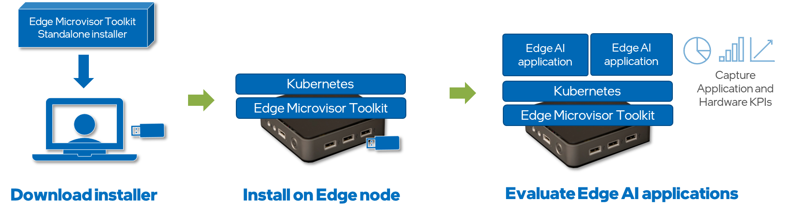

# Edge Microvisor Toolkit Standalone Node

Designed to enable Edge AI applications evaluation on Intel platforms.

## Overview

The Edge Microvisor Toolkit Standalone Node solution, designed to enable Edge AI applications evaluation on Intel platforms is designed to empower enterprise customers and developers by providing a rapid and efficient means to familiarize, evaluate, and trial Edge AI applications on Intel Architecture-based platforms. This comprehensive solution stack includes the edge-optimized immutable Edge Microvisor Toolkit, integrated with Kubernetes and foundational extensions, enabling the deployment of both cloud-native and legacy VM-based applications.

Key Features:

- **Edge Optimized Immutable Toolkit**: The Edge Microvisor Toolkit is specifically optimized for edge environments, ensuring robust performance on Intel Architecture-based platforms and security.
- **Kubernetes Integration**: Seamlessly deploy and manage applications using Kubernetes and cloud-native tools.
- **Foundational Extensions**: These extensions support the deployment of diverse application types, including both modern cloud-native and traditional VM-based applications.

Upon completion of the evaluation using the Edge Microvisor Toolkit Standalone Node solution, designed to enable Edge AI applications evaluation on Intel platforms customers will gain critical insights into the capabilities of edge platforms and Edge AI applications. This knowledge is essential for deploying use-case-specific applications and will significantly aid in scaling out deployments.

## How It Works

To begin the evaluation process, the customer downloads the Edge Microvisor Toolkit Standalone Node installer to their laptop or development system. This system will be used to create a bootable USB installer for the edge node designated for evaluation. During this stage, the customer can configure settings such as proxy and user credentials.

Next, the customer runs the automated installer, which generates a bootable USB stick. This USB stick is self-contained and includes all the necessary software components to install the Edge Microvisor Toolkit, Kubernetes, foundational Kubernetes extensions, and the Kubernetes Dashboard.

With the bootable USB stick prepared, the customer can proceed to install it on the edge node.

Once the edge node is up and running, the customer evaluates various Edge AI applications, pipelines, and microservices available from the Intel Edge services catalog and open-source repositories using standard tools like `helm`.

System requirements for the hardware and software requirements Edge Microvisor Toolkit Standalone Node is designed to support all Intel® platforms with the latest Intel® kernel to ensure all features are exposed and available for application and workloads. The microvisor has been validated on the following platforms.

  

### System Requirements

The Edge Microvisor Toolkit Standalone Node solution is engineered to support a diverse range of Intel® platforms, ensuring compatibility and optimal performance. Below is a detailed summary of the supported processor families and system requirements:

#### Supported Processor Families

| Processor Family            | Supported Models                                                                |
|-----------------------------|---------------------------------------------------------------------------------|
| **Intel Atom® Processors**  | Intel® Atom® X Series                                                           |
| **Intel® Core™ Processors** | 12th Gen Intel® Core™, 13th Gen Intel® Core™, Intel® Core™ Ultra (Series 1)     |
| **Intel® Xeon® Processors** | 4th Gen Intel® Xeon® SP, 3rd Gen Intel® Xeon® SP                                |

#### Memory, Storage and Networking Requirements

| Component      | Minimum Requirements           |
|----------------|--------------------------------|
| **RAM**        | 8GB                            |
| **Storage**    | 128GB SSD/HDD or NVMe          |
| **Networking** | Wired Ethernet                 |
| **GPU**        | Integrated GPU (i915)          |

For detailed steps and running sample applications refer to the [Get Started Guide](Get-Started-Guide.md).
