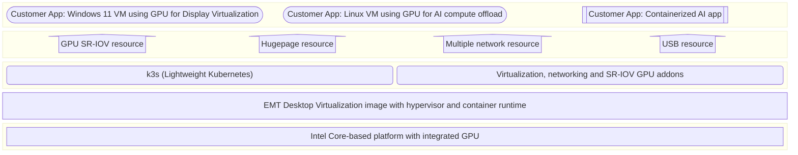

# Desktop Virtualization on Edge Microvisor Toolkit (EMT)

## Overview

This guide explains how to use of the Edge Microvisor Toolkit (EMT) to create an immutable Desktop
Virtualization image. It also provides configuration of cloud-init for deploying EMT images with
Desktop Virtualization features.

The EMT Desktop Virtualization image supports the following features:

- **SR-IOV**: Single Root I/O Virtualization for Intel integrated graphics.
- **Display Virtualization**: Enables display virtualization for VMs using Intel integrated graphics.
  This feature has been validated on both Windows 11 and Linux VMs.
- **USB Passthrough**: Supports USB passthrough for VMs, including keyboard and mouse devices.
- **Network Bridge**: Provides network bridge support, allowing VMs to connect to the network via the host's
  network interface.
- **Self-contained Image**: Includes a container runtime, lightweight Kubernetes, and additional Kubernetes
  add-ons for networking and GPU resource allocation. As a result, the image is larger than the standard EMT
  image.

You can use this image in the EMT standalone project to automate the deployment of edge nodes.



## Infrastructure resource usage KPI

Infrastructure resource utilization KPI measurement were conducted on the following hardware:

- 13th Gen Intel(R) Core(TM) i7-1365URE
- CPU(s): 12
- Mem:62Gi
- HDD: 931.5G (nvme)

EMT Desktop Virtualization infra consists of following components

```bash
  Namespace                   Name                                        CPU Requests  CPU Limits  Memory Requests  Memory Limits  Age
  ---------                   ----                                        ------------  ----------  ---------------  -------------  ---
  default                     intel-gpu-plugin-kjpcm                      40m (0%)      100m (0%)   45Mi (0%)        90Mi (0%)      31m
  kube-system                 calico-kube-controllers-64b69c8f54-llhbw    0 (0%)        0 (0%)      0 (0%)           0 (0%)         31m
  kube-system                 calico-node-qp92s                           250m (2%)     0 (0%)      0 (0%)           0 (0%)         31m
  kube-system                 coredns-697968c856-dlzw6                    100m (0%)     0 (0%)      70Mi (0%)        170Mi (0%)     31m
  kube-system                 device-plugin-jk4q7                         0 (0%)        0 (0%)      0 (0%)           0 (0%)         31m
  kube-system                 kube-multus-ds-bwn2r                        100m (0%)     100m (0%)   50Mi (0%)        50Mi (0%)      31m
  kube-system                 local-path-provisioner-774c6665dc-hd7l5     0 (0%)        0 (0%)      0 (0%)           0 (0%)         31m
  kube-system                 metrics-server-6f4c6675d5-8t8v8             100m (0%)     0 (0%)      70Mi (0%)        0 (0%)         31m
  kubevirt                    virt-api-57fbc959fb-4svfj                   5m (0%)       0 (0%)      500Mi (1%)       0 (0%)         30m
  kubevirt                    virt-controller-cc4564f8f-ggsjb             10m (0%)      0 (0%)      275Mi (0%)       0 (0%)         30m
  kubevirt                    virt-controller-cc4564f8f-l8rtz             10m (0%)      0 (0%)      275Mi (0%)       0 (0%)         30m
  kubevirt                    virt-handler-8pnlp                          10m (0%)      0 (0%)      357Mi (0%)       0 (0%)         30m
  kubevirt                    virt-operator-64645b6948-lf788              10m (0%)      0 (0%)      450Mi (1%)       0 (0%)         31m
  kubevirt                    virt-operator-64645b6948-qg6wj              10m (0%)      0 (0%)      450Mi (1%)       0 (0%)         31m
```

### Summary of resource utilization

- Consume 5% or less CPU without workload running (0.6 core)
- Consume less than 3G of RAM (on 64G system) without workload running
- Consume less than 2% of HDD space (on 1TB HDD)

> **Note** RAM usage is directly Proportional to the number of `hugepages` allocated and user should tune according to needs.

## Reference cloud-init for EMT image with Desktop Virtualization and networking features

Use this configuration to enable desktop virtualization and networking features in the
microvisor image.

Note that the `guest` Linux username is used throughout this configuration (e.g., in sudoers, systemd user services, etc.).
To use a different username, replace all occurrences of `guest` with the `user_name` that you set in the
`User Credentials` section of the `config-file`.

For example, if your user is `myuser`, replace `guest` with `myuser` in:

- `/etc/sudoers.d/idv_scripts`
- `/etc/systemd/system/getty@tty1.service.d/autologin.conf`
- `runcmd` section (sudo -u ...)
- Any other relevant locations in this file.

**Use and customize the following configuration script:**

```yaml
#cloud-config

# === Enable or disable systemd services ===
# List services to enable or disable.
# Note : Make sure Services should be part of the Base Image to enable or disable.
# Example:
#   services:
#     enable: [docker, ssh]
#     disable: [apache2]
services:
    enable: []
    disable: []

# === Create custom configuration files ===
# To create a file, specify its path,permission and content.
# Note : you can create as many files(shell,text,yaml) as you wish,just expand the write_files: with prefix -path for next file
# Note : Make sure scripts/files passing to cloud-init file are well tested. In case of any issues in the script/file, error messages
#        will be present in the /var/log/cloud-init-output.log file on EMT image.
# Example:
#   write_files:
#     - path: /etc/cloud/test.sh
#        permissions: '0644'
#       content: |
#         #!/bin/sh
#         echo "This is Example"
write_files:
  - path: /etc/environment
    append: true
    content: |
      export INTEL_IDV_GPU_PRODUCT_ID=$(cat /sys/devices/pci0000:00/0000:00:02.0/device | sed 's/^0x//')
      export INTEL_IDV_GPU_VENDOR_ID=$(cat /sys/devices/pci0000:00/0000:00:02.0/vendor | sed 's/^0x//')
  - path: /etc/systemd/system/nw_custom_file.service
    content: |
      [Unit]
      Description=network custom file services
      After=network.target
      [Service]
      WorkingDirectory=/opt/user-apps/scripts/management/
      ExecStart=bash /opt/user-apps/scripts/management/nw_custom_service.sh
      Restart=on-failure
      [Install]
      WantedBy=multi-user.target
  # autologin.conf configures automatic login for the specified user on tty1.
  # Change AUTOLOGIN_USER to your intended username if not using 'guest' user.
  # autologin.conf configures automatic login for the specified user on tty1.
  # Change AUTOLOGIN_USER to your intended username if not using 'guest' user.
  - path: /etc/systemd/system/getty@tty1.service.d/autologin.conf
    permissions: '0644'
    content: |
      [Service]
      Environment="AUTOLOGIN_USER=guest"
      ExecStart=
      ExecStart=-/sbin/agetty -o '-f -- \\u' --autologin $AUTOLOGIN_USER --noclear %I $TERM

  # Change `guest` to your intended username if not using 'guest' user.
  - path: /etc/sudoers.d/idv_scripts
    permissions: '0644'
    content: |
      guest ALL=(ALL) NOPASSWD: /usr/bin/X, \
      /usr/bin/idv/init/setup_sriov_vfs.sh, \
      /usr/bin/idv/init/setup_display.sh, \
      /usr/bin/idv/launcher/start_vm.sh, \
      /usr/bin/idv/launcher/start_all_vms.sh, \
      /usr/bin/idv/launcher/stop_vm.sh, \
      /usr/bin/idv/launcher/stop_all_vms.sh

  - path: /usr/share/X11/xorg.conf.d/10-serverflags.conf
    permissions: '0644'
    content: |
      Section "ServerFlags"
           Option "StandbyTime" "0"
           Option "SuspendTime" "0"
           Option "OffTime"     "0"
           Option "BlankTime"   "0"
      EndSection

  - path: /usr/share/X11/xorg.conf.d/10-extensions.conf
    permissions: '0644'
    content: |
      Section "Extensions"
          Option "DPMS" "false"
      EndSection

  - path: /etc/udev/rules.d/99-usb-qemu.rules
    permissions: '0644'
    content: |
      ACTION=="add", SUBSYSTEM=="usb", MODE="0664", GROUP="qemu", OWNER="qemu"

    # Change `guest` to your intended username if not using 'guest' user.
  - path: /etc/cloud/rc.xml
    permissions: '0644'
    owner: 'guest:guest'
    content: |
      <openbox_config xmlns="http://openbox.org/3.6/rc">
        <keyboard>
          <keybind key="A-C-t">
            <action name="Execute">
              <command>xterm</command>
            </action>
          </keybind>
        </keyboard>
      </openbox_config>

  - path: /etc/cloud/custom_network.conf
    permissions: '0644'
    content: |
      # custom_network.conf
      # Update this file to specify custom network settings for the bridge configuration script.
      # Set the CIDR, gateway, netmask, IP range, and DNS server for your environment.
      # If EdgeNode cannot reach Internet. DNS update needed.

      BR_NAME="br0"                    # Bridge interface name
      BR_CIDR="199.168.1.0/24"         # Bridge interface IP address and subnet (CIDR notation)
      BR_GATEWAY="199.168.1.1"         # Default gateway for the bridge network
      BR_NETMASK="24"                  # Netmask for the bridge network (as a number, e.g., 24)
      BR_START_RANGE="199.168.1.2"     # Start of the DHCP/static IP range for clients
      BR_END_RANGE="199.168.1.20"      # End of the DHCP/static IP range for clients
      BR_DNS_NAMESERVER="8.8.8.8"      # DNS server to use for the bridge network.

# === Custom run commands ===
# List commands or scripts to run at boot.
# Note : Make sure syntax is correct for the commands. In case of any issues in commands, error messages will be present
#        in the /var/log/cloud-init-output.log file on EMT image.
# Example:
#   runcmd:
#     - systemctl restart myservice
#     - bash /etc/cloud/test.sh
# If custom scripts in user-apps are getting not getting invoked. please make sure to add the scripts in "user-apps" folder
# Example:
#   runcmd:
#     - bash /opt/user-apps/network-config.sh /etc/cloud/custom_network.conf
runcmd:
  # Source /etc/environment to ensure newly created environment variables are available to subsequent commands in this boot sequence
  - source /etc/environment
  - udevadm control --reload-rules
  # Add the user to render group (assuming username is 'user')
  - sudo usermod -a -G render user
  - sudo -u user mkdir -p /home/user/.config/openbox/
  - sudo -u user mv /etc/cloud/rc.xml /home/user/.config/openbox/rc.xml
  # Change `guest` to your intended username if not using 'guest' user.
  - sudo -u user XDG_RUNTIME_DIR=/run/user/$(id -u user) systemctl --user enable idv-init.service
  - sudo -u user XDG_RUNTIME_DIR=/run/user/$(id -u user) systemctl --user start idv-init.service
  - sudo systemctl start nw_custom_file.service
  - test -f /opt/user-apps/scripts/management/apply_bridge_nad.sh && bash /opt/user-apps/scripts/management/apply_bridge_nad.sh /etc/cloud/custom_network.conf > /etc/cloud/apply_bridge_nad.log 2>&1
  # User shall add their application specific commands to automate the application deployment like this
  # bash /opt/user-apps/scripts/management/app-deploy.sh
```
