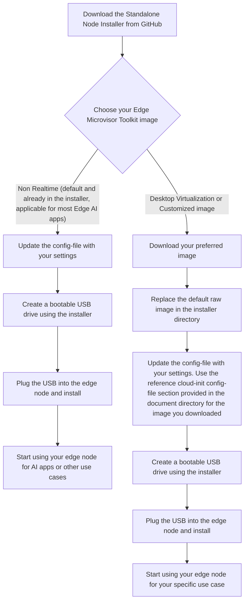

# Get Started

The Edge Microvisor Toolkit Standalone Node uses the standard immutable build. You can
build your own bootable USB from source code, or use the downloadable ISO
image that can be flashed to a USB device and installed on edge nodes. It
installs the microvisor and Kubernetes to the edge node with the essential
functionality to run a single node cluster. The edge node will serve as both the
control and worker node. Additional worker nodes can be added to the cluster
through Kubernetes.

Future releases will enable standalone edge nodes to join an existing Edge
Management Framework backend, deployed on-prem or in the cloud to support scale
out and management of larger infrastructures. The Standalone Edge Node enables
you to quickly get an edge node up and running without deploying backend
services, ready to deploy Kubernetes applications through `kubectl`, `helm`, or
Kubernetes web dashboard.

> **Note**: The standalone edge node does not currently support the real-time version.

## Standalone Node Provisioning

### Creating a bootable USB from Source Code

On Linux operating systems, you can create a bootable USB drive using source code. This section offers
detailed instructions to establish the necessary environment for USB-based provisioning of a standalone node.

Source code for the Edge Microvisor Toolkit Standalone Node is available at
[Open Edge Platform GitHub](https://github.com/open-edge-platform/edge-microvisor-toolkit-standalone-node).

Edge Microvisor Toolkit Standalone Node supports installation of EMT image of user choice.
Following EMT image types are supported to meet specific needs of edge deployment:

- Edge Microvisor Toolkit Non Realtime image
- Edge Microvisor Toolkit desktop virtualization image
- Customized immutable Edge Microvisor Toolkit created using "Edge Microvisor Toolkit Developer Node"

> **Note:** User shall update the config-file according to the requirement of the customized
> Edge Microvisor Toolkit immutable image

By default the installer is packaged with Edge Microvisor Toolkit Non Realtime image.

Users can download or can re-use the customized EMT image of their choice and replace the default EMT image
in the installer directory before creating the bootable USB.

The diagram below illustrates the steps involved in the USB-based provisioning of the standalone node.



> **Tip:** For most users, the default Non Realtime image is recommended. Advanced users can swap in other images as needed.

### Step 1: Prepare

#### 1.1: Repository Setup

Start by cloning the repository that holds all the essential scripts and configurations for deployment.
This step is vital for obtaining the tools needed for the standalone node.

```bash
git clone https://github.com/open-edge-platform/edge-microvisor-toolkit-standalone-node
cd edge-microvisor-toolkit-standalone-node
```

#### 1.2: Create the Standalone Installer

- To create the standalone installation tar file with all required files for preparing a bootable USB
  device, run the following command

   ```bash
   sudo make build
   ```

> **Note:** This command will generate the `standalone-installation-files.tar.gz` file.
  The file will be located in the `$(pwd)/installation-scripts/out` directory.

#### 1.3: Prepare the bootable USB Drive

> **Note:**
>
> - Ensure **the correct USB drive is selected** to avoid data loss.
> - **Replace `/dev/sdX`** with the actual device name of your USB drive.

- Insert the USB drive into the Developer's System and identify the USB disk:

   ```bash
   lsblk -o NAME,MAJ:MIN,RM,SIZE,RO,FSTYPE,MOUNTPOINT,MODEL
   ```

   > **Note:** Ensure the correct USB drive is selected to avoid data loss.

- Use the wipefs command to remove any existing filesystem signatures from the USB drive.
  This ensures a clean slate for formatting

   ```bash
   sudo wipefs --all --force /dev/sdX
   ```

- Format the USB drive with a FAT32 filesystem using the mkfs.vfat command.

   ```bash
   sudo mkfs.vfat /dev/sdX
   ```

- Unmount the USB drive to ensure the creation of bootable USB.

  - Check what is currently mounted:

    ```bash
    df -hT
    ```

  - Unmount the drive:

    ```bash
    sudo umount /dev/sdX
    ```

- Copy standalone installation tar file to developer system to prepare the Bootable USB

  Extract the contents of standalone-installation-files.tar.gz

  ```bash
   tar -xzf standalone-installation-files.tar.gz
  ```

- Extracted files will include

  ```text
  bootable-usb-prepare.sh
  write-image-to-usb.sh
  config-file
  usb-bootable-files.tar.gz
  edgenode-logs-collection.sh
  standalone-vm-setup.sh
  download_images.sh
  user-apps
  ```

- Download the kubernetes artifacts (container images and manifest files). This step is done by
  executing the ./download_images.sh script. If you are using EMT image with desktop virtualization
  features then use `DV` parameter. For default EMT image which is a non-Real Time kernel use `NON-RT`
  parameter.

   ```bash
   sudo ./download_images.sh DV

   or

   sudo ./download_images.sh NON-RT
   ```

> **Note:** By default the script will only pull basic kubernetes artifacts to create a single node cluster.

- Update the `config-file` with your deployment-specific settings.
This configuration file is used to provision the edge node during
its initial boot and should include the following parameters:

  - **Proxy settings:** Specify if the edge node requires a proxy to access external networks.
  - **SSH key:** Provide the public SSH key (typically your
  `id_rsa.pub`) from your Linux development system to enable passwordless SSH access to the edge node.
  - **User credentials:** Define the username and password for the primary user account on the edge node.
  - **Cloud-init customization:** Optionally, include user-defined `cloud-init` configurations for advanced setup requirements.
    - For the default EMT Non-Realtime image, a basic
    Kubernetes installation will be performed automatically.
    - For deployments requiring Desktop Virtualization features,
      refer to the [desktop-virtualization-image-guide](desktop-virtualization-image-guide.md) in the
      `user-guide` directory. This document provides reference `cloud-init` configurations that can be
      tailored to your specific deployment needs.
  - **Hugepages configuration:** Set hugepages parameters if your workloads require them.

- Run the preparation script to create the bootable USB

   ```bash
   sudo ./bootable-usb-prepare.sh </dev/sdX> usb-bootable-files.tar.gz config-file
   ```

- Required Inputs for the Script:

    ```bash
     - usb: A valid USB device name (e.g., `/dev/sdc`)
     - usb-bootable-files.tar.gz: The tar file containing bootable files
     - config-file: Configuration file with deployment-specific settings
    ```

> **Note:** Providing proxy settings is optional if the edge node does not require them to access internet services.
> **Additional Customization:** If you want to add specific configurations,
helm charts, or packages to your deployment, you can refer to the
[pre-loading-user-apps guide](pre-loading-user-apps.md) for detailed
instructions on customizing your EMT image.

#### 1.4: Choose Your Edge Microvisor Toolkit Image

The Edge Microvisor Toolkit Standalone Node supports different EMT images to
meet specific edge deployment needs. You can choose from:

- **Edge Microvisor Toolkit Non Realtime image** (default)
- **Edge Microvisor Toolkit Desktop Virtualization image**
- **Customized immutable Edge Microvisor Toolkit created using "Edge Microvisor Toolkit Developer Node"**

##### Option 1: Using the Default Non Realtime Image

If you opt for the default Non-Realtime image, which is suggested for the majority of Edge AI applications,
there's no need for further image setup. The usb-bootable-files.tar.gz installer comes with this image pre-included.

##### Option 2: Using Desktop Virtualization or Custom created image

If you need Desktop Virtualization features, follow these steps to replace the default image:

1. Desktop Virtualization image: Download from the no Auth file server registry

> **Note:** Custom created image can be copied locally from your development system to the 5th
> partition as shown in step 2 below.

1. Replace the default EMT image with the EMT DV or custom created image. The
default EMT image is located at the 5th partition of the
bootable USB drive created in the previous step.
Follow these steps to replace the image:

  ```bash
  # Create a test directory for mounting
  sudo mkdir -p /mnt/test

  # Mount the 5th partition of the USB drive
  sudo mount /dev/sda5 /mnt/test

  # Navigate to the mounted directory
  cd /mnt/test

  # Remove the older image (backup first if needed)
  sudo rm -f <old-image-file>

  # For Desktop Virtualization image: Download from registry
  sudo wget <your-dv-image-url> -O <new-image-file>
  
  # For Custom created image: Copy from local directory to 5th partition
  sudo cp /path/to/your/custom-image.raw ./

  # Unmount the partition
  cd /
  sudo umount /mnt/test
  ```

The DV image is available here [Download DV Image](https://files-rs.edgeorchestration.intel.com/files-edge-orch/repository/microvisor/dv/edge-readonly-dv-3.0.20250717.0840.raw.gz)

  > **Important:** These steps are manually executed by the user to put the desired image
  > into the 5th partition before standalone deployment mentioned in
  > [Step 2: Deploy Edge Node](#step-2-deploy-edge-node)

## Step 2: Deploy Edge Node

- Unplug the attached bootable USB from developer system

- Plug the created bootable USB pen drive into the standalone node

- Set the BIOS boot manager to boot from the USB pen drive

- Reboot the Standalone Node
  This will start Microvisor installations.

- Automatic Reboot
  The standalone edge node will automatically reboot into Microvisor.

- First Boot Configuration
  During the first boot, cloud-init will install the k3s Kubernetes cluster.

### 2.1 Login to the Edge Node After Installation Completes

Refer to the edge node console output for instructions to verify the kubernetes cluster creation.

Use the Linux login credentials which was provided while preparing the bootable USB drive.

**Note:** If you want to run kubectl commands from the edge node you can use the provided alias ``k``
which is defined in the .bashrc of the user defined in your config.

```bash
k get pods -A
```

## Step 3: Set up tools on Developer's System

Install and configure [kubectl](https://kubernetes.io/docs/tasks/tools/install-kubectl-linux/) and
[helm](https://helm.sh/docs/intro/install/) tools on the Developer's system.

> **Note:** The commands are executed from `Linux` environment, but the same can be achieved from any
environment supporting `kubectl` and `helm` by using equivalent commands.

1. Install `kubectl`:

   ```bash
   sudo apt-get update
   sudo apt-get install -y apt-transport-https ca-certificates curl gnupg
   curl -fsSL https://pkgs.k8s.io/core:/stable:/v1.32/deb/Release.key | \
     sudo gpg --dearmor -o /etc/apt/keyrings/kubernetes-apt-keyring.gpg
   sudo chmod 644 /etc/apt/keyrings/kubernetes-apt-keyring.gpg
   echo 'deb [signed-by=/etc/apt/keyrings/kubernetes-apt-keyring.gpg] \
     https://pkgs.k8s.io/core:/stable:/v1.32/deb/ /' | \
     sudo tee /etc/apt/sources.list.d/kubernetes.list
   sudo chmod 644 /etc/apt/sources.list.d/kubernetes.list
   sudo apt-get update
   sudo apt-get install -y kubectl
   ```

2. Copy the kubeconfig file from the Edge Node:

   ```bash
   mkdir ~/.kube
   export EN_IP=<EN_IP>
   scp user@${EN_IP}:/etc/rancher/k3s/k3s.yaml ~/.kube/config
   ```

3. Update the Edge Node IP in the kubeconfig file and export the path as KUBECONFIG:

   ```bash
   sed -i "s/127\.0\.0\.1/${EN_IP}/g" ~/.kube/config
   export KUBECONFIG=~/.kube/config
   ```

4. Test the connection:

   ```bash
   kubectl get pods -A
   ```

5. Install `helm`:

   ```bash
   curl -fsSL -o get_helm.sh https://raw.githubusercontent.com/helm/helm/main/scripts/get-helm-3
   chmod 700 get_helm.sh
   ./get_helm.sh
   ```

## Step 4: Install Sample Application

Install a WordPress application as a test application using `helm`.

1. Add the `bitnami` repository:

   ```bash
   helm repo add bitnami https://charts.bitnami.com/bitnami
   ```

2. Create a values override file `values-wp.yaml`, replace the `<pass>` with a password and install WordPress:

   ```yaml
   mariadb:
     primary:
       persistence:
         enabled: false
     auth:
       password: <pass>
       rootPassword: <pass>>
   wordpressUsername: admin
   wordpressPassword: <pass>
   persistence:
     enabled: false
   resources:
     requests:
       cpu: 0m
       memory: 0Mi
   service:
     type: ClusterIP
     annotations:
       service-proxy.app.orchestrator.io/ports: "80"
       external-dns.alpha.kubernetes.io/hostname: "wordpress.example.org"
   ```

   ```bash
   helm install my-wordpress bitnami/wordpress --namespace wordpress \
     --create-namespace -f values-wp.yaml --version 19.4.3
   ```

3. View the pods running

   ```bash
   kubectl get pods -n wordpress
   NAME                           READY   STATUS    RESTARTS       AGE
   my-wordpress-d57b44f9c-lw69m   1/1     Running   3 (3m4s ago)   10m
   my-wordpress-mariadb-0         1/1     Running   0              10m
   ```

4. Forward port to be able to access WP

   ```bash
   kubectl port-forward --namespace wordpress svc/my-wordpress 8080:80
   ```

5. Access the WP blog from browser using `http://localhost:8080/admin` URL.

6. Login using the `admin` (login) and `password` (`<pass>`) credentials

> **Note:** Edge AI applications from the Edge software catalog can be installed using `helm` and
evaluated using similar steps.

## Step 5: Upgrade to the EMT

Edge Microvisor Toolkit Standalone Node supports upgrading to a newwer version
of EMT image via split A/B immutable update mechanism. For detailed instruction
refer to [emt-update-guide](emt-update-guide.md).

## Troubleshooting

1. **Creation of bootable USB failed**

   The possible reason could be USB device is mounted. Please unmount the USB drive and retry creating the bootable USB drive.

2. **Issues while provisioning the microvisor**

   If you encounter issues during microvisor provisioning with the EMT boot kit, you can login
   with root username and password using `chroot` to check the `/var/log/os-installer.log` file
   for detailed error messages and troubleshooting information.

3. **Installation status banner**

   After successful installation, a banner is printed at the end, summarizing the installation status and
   providing useful commands/logs path for further management.
