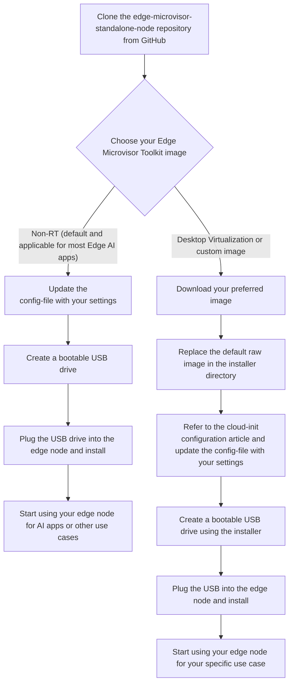

# Get Started

The Edge Microvisor Toolkit Standalone Node uses the standard immutable build. You can
build your own bootable USB from source code, or use the downloadable ISO
image that can be flashed to a USB device and installed on edge nodes. It
installs the microvisor and Kubernetes to the edge node with the essential
functionality to run a single node cluster. The edge node will serve as both the
control and worker node. Additional worker nodes can be added to the cluster
through Kubernetes.

The Standalone Edge Node can be included in
[Edge Manageability Framework](https://github.com/open-edge-platform/edge-manageability-framework),
deployed on-premises or in the cloud to support scale out and management of larger infrastructures.
It enables you to quickly get an edge node up and running without deploying backend
services, ready to deploy Kubernetes applications through `kubectl`, `helm`, or
Kubernetes web dashboard.

## Standalone Node Provisioning

### Create a Bootable USB Drive Using Source Code

You can create a bootable USB drive using source code and a selected version of
Edge Microvisor Toolkit Standalone Node:

- Edge Microvisor Toolkit Non-RT (standard kernel)
- Edge Microvisor Toolkit Desktop Virtualization
- Custom immutable Edge Microvisor Toolkit created using 
  [Edge Microvisor Toolkit Developer Node](https://github.com/open-edge-platform/edge-microvisor-toolkit/blob/3.0/docs/developer-guide/get-started/emt-building-howto.md)

> **Note:** Make sure to update `config-file` according to the requirements of the custom
> Edge Microvisor Toolkit immutable image.

You can download or re-use your own custom EMT image and replace the default EMT image
in the installer directory before creating the bootable USB drive.

See the diagram below to learn how USB-based provisioning of the standalone node works.



> **Tip:** For most users, the default Non-RT image is recommended. Advanced users can use other images as needed.

### Step 1: Prepare

#### 1.1: Repository Setup

Start by cloning the repository that holds all the essential scripts and configurations for deployment.
This step is vital for obtaining the tools needed for the standalone node.

```bash
git clone https://github.com/open-edge-platform/edge-microvisor-toolkit-standalone-node
cd edge-microvisor-toolkit-standalone-node
```

#### 1.2: Create the Standalone Installer

- To create the standalone installation tar file with all required files for preparing a bootable USB
  device, run the following command

   ```bash
   sudo make build
   ```

> **Note:** This command will generate the `standalone-installation-files.tar.gz` file.
  The file will be located in the `$(pwd)/installation-scripts/out` directory.

#### 1.3: Prepare the bootable USB Drive

> **Note:**
>
> - Ensure **the correct USB drive is selected** to avoid data loss.
> - **Replace `/dev/sdX`** with the actual device name of your USB drive.

- Insert the USB drive into the Developer's System and identify the USB disk:

   ```bash
   lsblk -o NAME,MAJ:MIN,RM,SIZE,RO,FSTYPE,MOUNTPOINT,MODEL
   ```

   > **Note:** Ensure the correct USB drive is selected to avoid data loss.

- Use the wipefs command to remove any existing filesystem signatures from the USB drive.
  This ensures a clean slate for formatting

   ```bash
   sudo wipefs --all --force /dev/sdX
   ```

- Format the USB drive with a FAT32 filesystem using the mkfs.vfat command.

   ```bash
   sudo mkfs.vfat /dev/sdX
   ```

- Unmount the USB drive to ensure the creation of bootable USB.

  - Check what is currently mounted:

    ```bash
    df -hT
    ```

  - Unmount the drive:

    ```bash
    sudo umount /dev/sdX
    ```

- Copy the standalone installation tar file to developer system to prepare the Bootable USB drive.

  Extract the contents of `standalone-installation-files.tar.gz`:

  ```bash
   tar -xzf standalone-installation-files.tar.gz
  ```

- Extracted files will include

  ```text
  bootable-usb-prepare.sh
  write-image-to-usb.sh
  config-file
  usb-bootable-files.tar.gz
  edgenode-logs-collection.sh
  standalone-vm-setup.sh
  download_images.sh
  ```

- Download the kubernetes artifacts (container images and manifest files).

  This step is done by executing the `./download_images.sh` script. If you are using EMT
  image with desktop virtualization features then use `DV` parameter. For default EMT image,
  which is a non-RT kernel, use the `NON-RT` parameter.

   ```bash
   sudo ./download_images.sh DV

   or

   sudo ./download_images.sh NON-RT
   ```

> **Note:** By default the script will only pull basic kubernetes artifacts to create a single node cluster.

- Update `config-file` with your deployment-specific settings.

  This configuration file is used to provision the edge node during
  its initial boot and should include the following parameters:

  - **Proxy settings:** Specify if the edge node requires a proxy to access external networks.
  - **SSH key:** Provide the public SSH key (typically your
  `id_rsa.pub`) from your Linux development system to enable passwordless SSH access to the edge node.
  - **User credentials:** Define the username and password for the primary user account on the edge node.
  - **Cloud-init customization:** Optionally, include user-defined `cloud-init` configurations for advanced setup requirements.
    - For the default EMT non-RT image, a basic
      Kubernetes installation will be performed automatically.
    - For deployments requiring Desktop Virtualization features,
      refer to the [desktop-virtualization-image-guide](desktop-virtualization-image-guide.md).
      This document provides `cloud-init` configurations that can be
      tailored to your specific deployment needs.
  - **Hugepages configuration:** Set hugepages parameters if your workloads require them.

- Run the preparation script to create the bootable USB drive:

  ```bash
  sudo ./bootable-usb-prepare.sh </dev/sdX> usb-bootable-files.tar.gz config-file
  ```

- Required Inputs for the script:

  ```bash
   - usb: A valid USB device name (e.g., `/dev/sdc`)
   - usb-bootable-files.tar.gz: The tar file containing bootable files
   - config-file: Configuration file with deployment-specific settings
  ```

> **Note:** Providing proxy settings is optional if the edge node does not require them to
  access internet services.

> **Additional Customization:**
> If you want to add specific configurations, helm charts, or packages to your deployment,
> you can refer to the [pre-loading-user-apps guide](pre-loading-user-apps.md) for detailed
> instructions on customizing your EMT image.

#### 1.4: Choose Your Edge Microvisor Toolkit Image

The Edge Microvisor Toolkit Standalone Node supports different EMT images to
meet specific edge deployment needs. You can choose from:

- **Edge Microvisor Toolkit Non-RT image** (default)
- **Edge Microvisor Toolkit Desktop Virtualization image**
- **Customized immutable Edge Microvisor Toolkit created using "Edge Microvisor Toolkit Developer Node"**

##### Option 1: Using the Default Non-RT Image

If you opt for the default non-RT image, which is suggested for the majority of Edge AI applications,
there is no need for further image setup. The `usb-bootable-files.tar.gz` installer includes this image.

##### Option 2: Using Desktop Virtualization or Custom created image

If you need Desktop Virtualization features, follow these steps to replace the default image:

1. Download the desktop virtualization image (DV) from the "no Auth" file server registry.

   > **Note:** A custom image can be copied locally from your development system to the 5th
   > partition, as shown in **Step 2** below.

2. Replace the default EMT image with the EMT DV image or custom image. The
   default EMT image is located at the 5th partition of the
   bootable USB drive created in the previous step.
   Follow these steps to replace the image:

   ```bash
   # Create a test directory for mounting.
   sudo mkdir -p /mnt/test

   # Mount the 5th partition of the USB drive.
   sudo mount /dev/sda5 /mnt/test

   # Navigate to the mounted directory.
   cd /mnt/test

   # Remove the older image (backup first if needed).
   sudo rm -f <old-image-file>

   # For Desktop Virtualization image: Download from registry.
   sudo wget <your-dv-image-url> -O <new-image-file>
  
   # For Custom created image: Copy from a local directory to the 5th partition.
   sudo cp /path/to/your/custom-image.raw ./

   # Unmount the partition.
   cd /
   sudo umount /mnt/test
   ```

The DV image is available here [Download DV Image](https://files-rs.edgeorchestration.intel.com/files-edge-orch/repository/microvisor/dv/edge-readonly-dv-3.0.20250717.0840.raw.gz)

  > **Important:** These steps are manually executed by the user to put the desired image
  > into the 5th partition before [deploying the edge node](#step-2-deploy-edge-node).

## Step 2: Deploy Edge Node

1. Unplug the attached bootable USB drive from the developer system.
2. Plug the created bootable USB drive into the standalone node.
3. Set the BIOS boot manager to boot from the USB drive.
4. Reboot the Standalone Node

   This will start the Bootkit OS, followed by Microvisor installations.

5. Automatic Reboot

   The standalone edge node will automatically reboot into Microvisor.

6. First Boot Configuration

  During the first boot, `cloud-init` will install the k3s Kubernetes cluster.

### 2.1 Login to the Edge Node After Installation

Refer to the edge node console output for instructions to verify the kubernetes cluster creation.
Use the Linux login credentials which was provided while preparing the bootable USB drive.

**Note:** If you want to run `kubectl` commands from the edge node you can use the provided ``k`` alias,
which is defined in the `.bashrc` of the user defined in your config.

```bash
k get pods -A
```

## Step 3: Set up tools on Developer's System

Install and configure [kubectl](https://kubernetes.io/docs/tasks/tools/install-kubectl-linux/) and
[helm](https://helm.sh/docs/intro/install/) tools on the developer system.

> **Note:** The commands are executed from `Linux` environment, but the same can be achieved from any
  environment supporting `kubectl` and `helm` by using equivalent commands.

1. Install `kubectl`:

   ```bash
   sudo apt-get update
   sudo apt-get install -y apt-transport-https ca-certificates curl gnupg
   curl -fsSL https://pkgs.k8s.io/core:/stable:/v1.32/deb/Release.key | \
     sudo gpg --dearmor -o /etc/apt/keyrings/kubernetes-apt-keyring.gpg
   sudo chmod 644 /etc/apt/keyrings/kubernetes-apt-keyring.gpg
   echo 'deb [signed-by=/etc/apt/keyrings/kubernetes-apt-keyring.gpg] \
     https://pkgs.k8s.io/core:/stable:/v1.32/deb/ /' | \
     sudo tee /etc/apt/sources.list.d/kubernetes.list
   sudo chmod 644 /etc/apt/sources.list.d/kubernetes.list
   sudo apt-get update
   sudo apt-get install -y kubectl
   ```

2. Copy the kubeconfig file from the Edge Node:

   ```bash
   mkdir ~/.kube
   export EN_IP=<EN_IP>
   scp user@${EN_IP}:/etc/rancher/k3s/k3s.yaml ~/.kube/config
   ```

3. Update the Edge Node IP in the kubeconfig file and export the path as `KUBECONFIG`:

   ```bash
   sed -i "s/127\.0\.0\.1/${EN_IP}/g" ~/.kube/config
   export KUBECONFIG=~/.kube/config
   ```

4. Test the connection:

   ```bash
   kubectl get pods -A
   ```

5. Install `helm`:

   ```bash
   curl -fsSL -o get_helm.sh https://raw.githubusercontent.com/helm/helm/main/scripts/get-helm-3
   chmod 700 get_helm.sh
   ./get_helm.sh
   ```

## Step 4: Install Sample Application

Install a WordPress application as a test application, using `helm`.

1. Add the `bitnami` repository:

   ```bash
   helm repo add bitnami https://charts.bitnami.com/bitnami
   ```

2. Create a values override file `values-wp.yaml`, replace the `<pass>` with a password and install WordPress:

   ```yaml
   mariadb:
     primary:
       persistence:
         enabled: false
     auth:
       password: <pass>
       rootPassword: <pass>
   wordpressUsername: admin
   wordpressPassword: <pass>
   persistence:
     enabled: false
   resources:
     requests:
       cpu: 0m
       memory: 0Mi
   service:
     type: ClusterIP
     annotations:
       service-proxy.app.orchestrator.io/ports: "80"
       external-dns.alpha.kubernetes.io/hostname: "wordpress.example.org"
   ```

   ```bash
   helm install my-wordpress bitnami/wordpress --namespace wordpress \
     --create-namespace -f values-wp.yaml --version 19.4.3
   ```

3. View the running pods:

   ```bash
   kubectl get pods -n wordpress
   NAME                           READY   STATUS    RESTARTS       AGE
   my-wordpress-d57b44f9c-lw69m   1/1     Running   3 (3m4s ago)   10m
   my-wordpress-mariadb-0         1/1     Running   0              10m
   ```

4. Forward the port to get access to WP:

   ```bash
   kubectl port-forward --namespace wordpress svc/my-wordpress 8080:80
   ```

5. Access the WP blog from browser using `http://localhost:8080/admin` URL.

6. Login, using the `admin` (login) and `password` (`<pass>`) credentials

> **Note:** Edge AI applications from the Edge Software Catalog can be installed using `helm` and
  evaluated using similar steps.

## Step 5: Upgrade to the EMT

Edge Microvisor Toolkit Standalone Node supports upgrading to a newer version
of EMT image via split A/B immutable update mechanism. For detailed instruction
refer to [emt-update-guide](emt-update-guide.md).

## Troubleshooting

1. **Creation of a bootable USB drive failed**

   The possible reason could be that the USB device is mounted.
   Please unmount it and retry creating the bootable USB drive.

2. **Issues while provisioning the microvisor**

   If you encounter issues during provisioning the microvisor with EMT Bootkit, you can login
   as root, using `chroot` to check the `/var/log/os-installer.log` file
   for detailed error messages and troubleshooting information.

3. **Installation status banner**

   After the successful installation, a summary is printed into terminal output.
   It shows the status of installation and provides useful commands/ paths to logs
   for further analysis and management.
