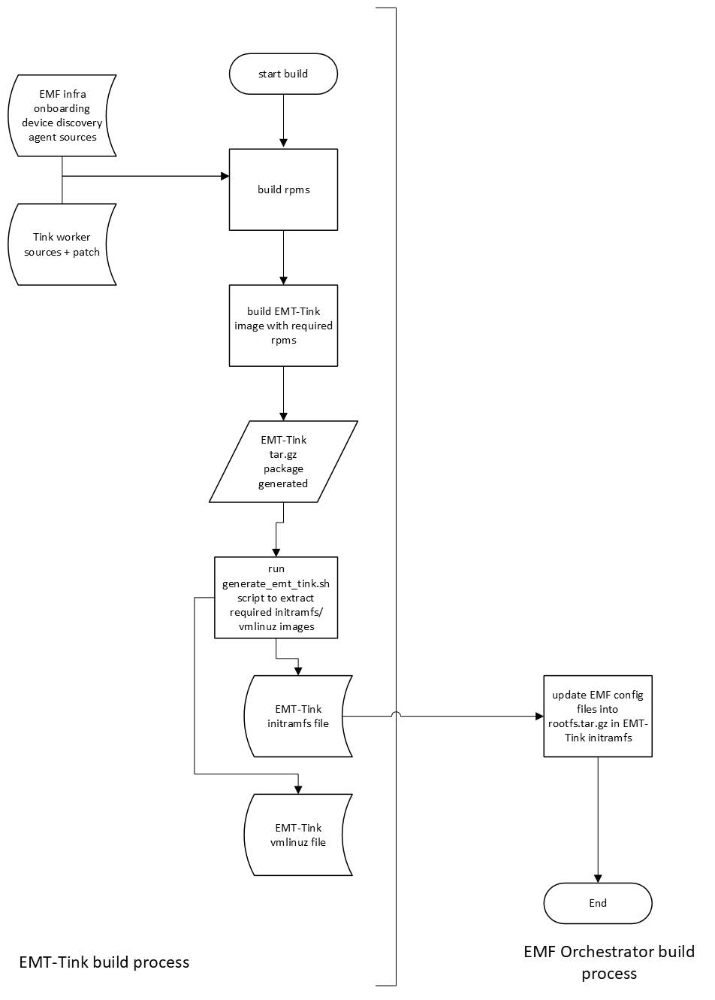

# Edge Microvisor Toolkit Tink (µOS)

Edge Microvisor Toolkit Tink (µOS) image is built from the same baseline same as other OS images.
IT has been introduced to replace HookOS in the build workflow, which was used in the 3.0
release.

The main [generate-tink-initramfs.sh](https://github.com/open-edge-platform/edge-microvisor-toolkit/blob/3.0/toolkit/imageconfigs/scripts/generate-tink-initramfs.sh) bash script provided in the Edge Microvisor Toolkit baseline is called to generate the 
required `initramfs` and `vmlinuz` images to be used in place of HookOS images. For more details, see the usage example below:

```bash
sudo toolkit/imageconfigs/scripts/generate-tink-initramfs.sh \
  -f <emt-tink.tar.gz> -o <output_images_dir>
```

The <emt-tink.tar.gz> is the "rootfs.tar.gz" generated from the µOS build.
The <output_images_dir> is the folder where output `vmlinuz`/`initramfs` files will be placed

The generated images can then be use for
[Edge Manageability Framework](#edge-manageability-framework-emf-specific-builds) or
[Edge Microvisor Toolkit Standalone Node](#edge-microvisor-toolkit-standalone-node-specific-builds)
builds for implementing required customizations.

To boot with the `vmlinuz` and `initramfs` images, the following additional kernel
parameters will be required:

```text
root=tmpfs rootflags=mode=0755 rd.skipfsck noresume modules-load=nbd
```

## Edge Manageability Framework and Edge Microvisor Toolkit Standalone Node Workflows

EMT-Tink is targeted for use in Edge Manageability Framework and Edge Microvisor Toolkit
Standalone Node workflows with a common set of built images. The diagram below shows
primary components in EMT-Tink (device-discovery, tink-worker) required for EMF provisioning is being built as rpms (sources from opensource) and included in EMT-Tink image output tar.gz file using standard EMT image build process.
The EMT-Tink image output file can then be transformed into initramfs and vmlinuz images required to boot as transitionary OS during EMF and EMT-S provisioning flows.
The generated initramfs and vmlinuz images are then utilized in EMF and EMT-S image builds during which edge node provisioning specific customizations are then included together with provided images to generate the final signed images which would be used during EMF and EMT-S provisioning

See the diagram for more details:




### EMF Build with HookOS (previous workflow)

In current EMF with hookOS, the following are built directly into HookOS image to generate EMF customized HookOS initramfs and vmlinuz images:

- caddy docker image + EMF caddy config for hookOS [Ref](https://github.com/open-edge-platform/infra-onboarding/blob/69402c21b34eefa430f3d0eb2540f1949a1b8a33/hook-os/hook.yaml#L276https://github.com/open-edge-platform/infra-onboarding/blob/69402c21b34eefa430f3d0eb2540f1949a1b8a33/hook-os/hook.yaml#L275)
- device discovery agent docker image [ref](https://github.com/open-edge-platform/infra-onboarding/tree/main/hook-os/device_discovery)
- Fluent-bit docker image + EMF fluent-bit config for hookOS [Ref](https://github.com/open-edge-platform/infra-onboarding/tree/main/hook-os/fluent-bit)

Generated customized HookFS initramfs and vmlinuz images are then downloaded to edge node over PXE boot.
HookOS pulls tink worker container image after booting to start running Tinkerbell workflow. In HookOS case, tink worker is a container which runs other containers in a docker-in-docker scenario.

### EMF Build with EMT-Tink (new workflow)

With EMT-Tink, caddy, fluent-bit, device discovery agent and tink worker are run as native systemd services in EMT OS.

Caddy and fluent-bit are existing rpm packages which are included in EMT-Tink.
[Device discovery agent](SPECS/device-discovery/device-discovery.spec) from EMF infra-onboarding github is build as rpm package to run as systemd service and included in the image:

tink worker is built as rpm to run as systemd service and included in EMT-Tink image: [PR](https://github.com/open-edge-platform/edge-microvisor-toolkit/pull/106)
tink worker in EMT-Tink is also patched such that it directly runs containers via using containerd only, without dependency on docker and avoiding docker-in-docker use case.

EMT-Tink will provide above vmlinuz and initramfs images for release to be used in EMF and EMT-S installer builds.

EMF orchestrator build will need adjustments to inject the following into EMT-Tink initramfs during build to generate the final EMF customized initramfs file for EMT-Tink case:

- EMF caddy config files
- fluent-bit config files
- Environment configuration file
- Cert files

## Edge Microvisor Toolkit Standalone Node Specific Builds

### Standalone Node Build with HookOS (previous workflow)

In Edge Microvisor Toolkit Standalone Node, current HookOS sources, separate from that used in
Edge Manageability Framework, are being used to generate required Hook OS images used in the
installer. Edge Microvisor Toolkit Standalone Node OS
[installer scripts](https://github.com/open-edge-platform/edge-microvisor-toolkit-standalone-node/blob/main/standalone-node/hook_os/files/install-os.sh) are built into the OS image and set up to run automatically in bash on boot.

Generated customized HookOS `initramfs` and `vmlinuz` are then used to generate EMT-S required iso for usb installer.

### Standalone Node Build with µOS (new workflow)

For this case, the same approach as being done with HookOS will be used.

EMT-S build will need adjustments to make the following changes into EMT-Tink initramfs before generate final iso for usb installer.

- include pkgs efibootmgr / gawk / lvm2 / net-tools / parted for EMT-S
- inject required EMT-S OS installer bash scripts and systemd service to run it as service
- disable tink worker, caddy, fluent-bit, device discovery agent services

